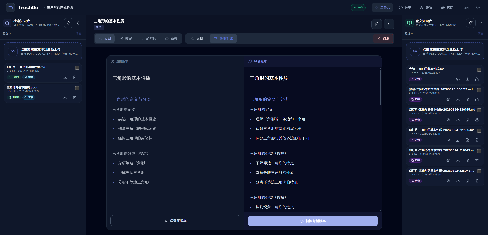
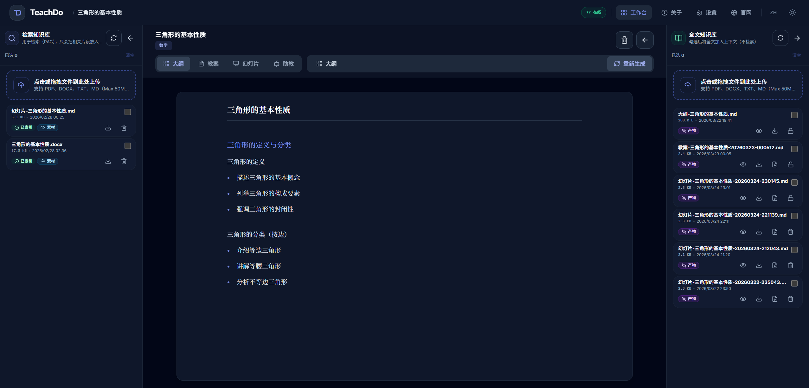
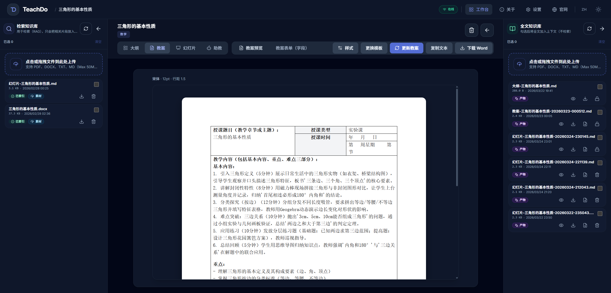
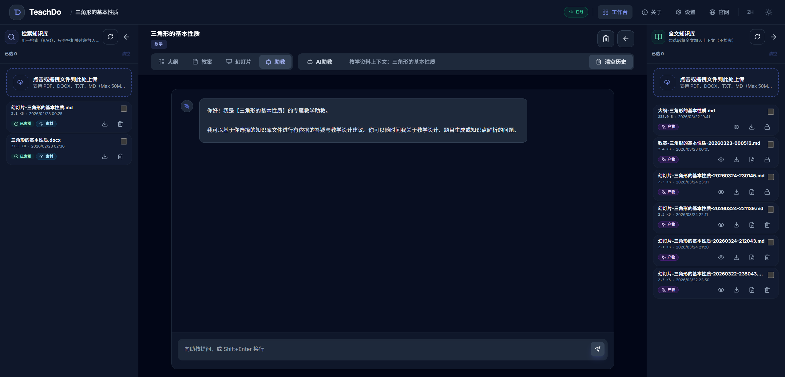
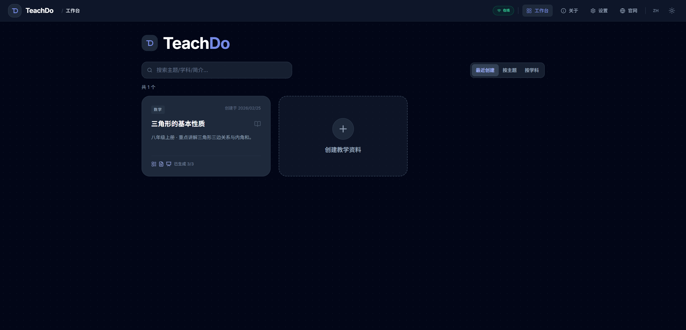
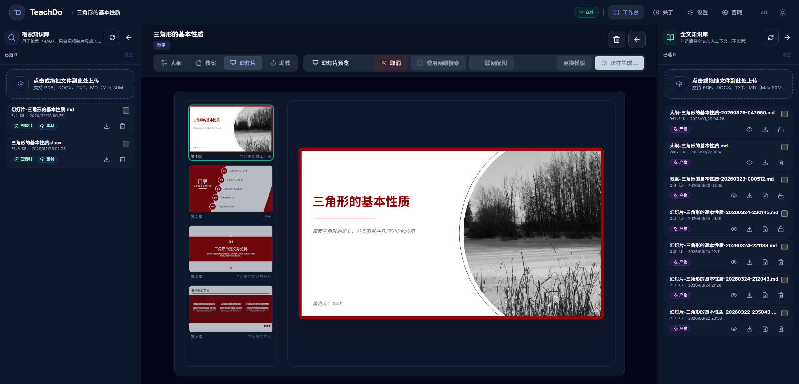
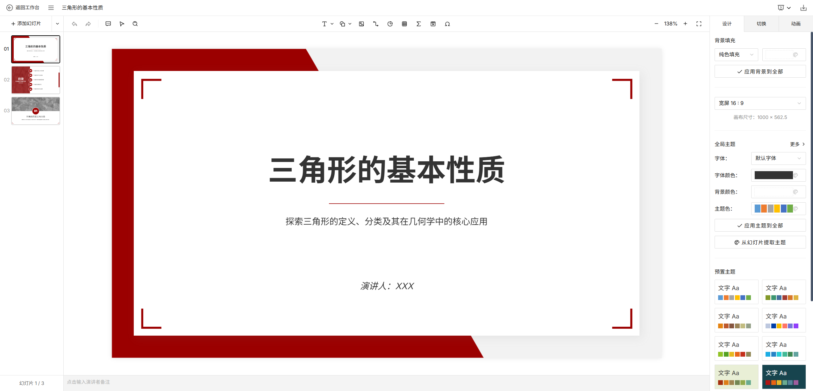
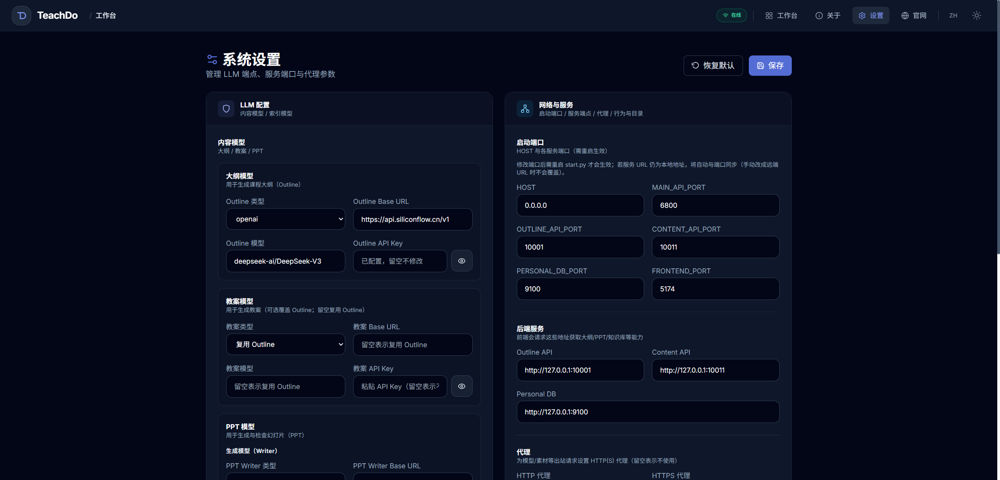
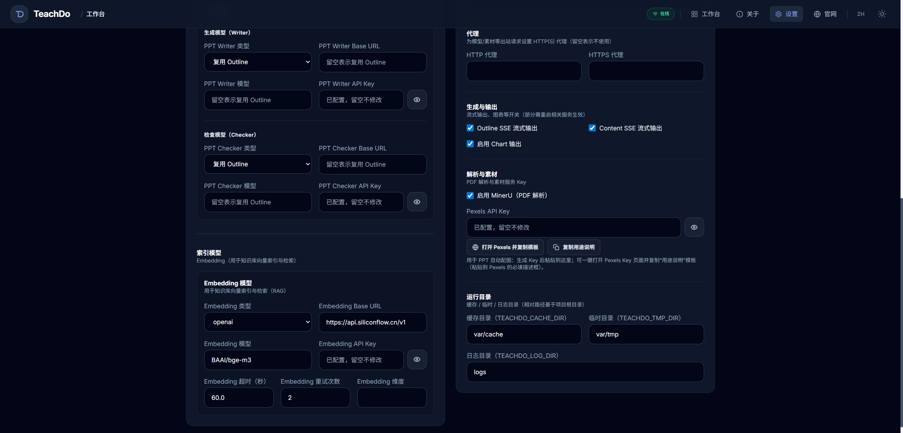

# TeachDo

TeachDo 是面向教师的智能备课平台。系统以“课程/单元”为工作流单元，支持大纲、教案、PPT 的流式生成，以及知识库增强、助教问答和独立编辑器导出。

## 项目截图



> 完整界面截图收纳在可展开画廊中

<details>
<summary>展开查看完整项目截图</summary>

<br>

<table>
  <tr>
    <td align="center" width="33%">
      
      <br>
      <sub>大纲生成</sub>
    </td>
    <td align="center" width="33%">
      
      <br>
      <sub>教案生成</sub>
    </td>
    <td align="center" width="33%">
      
      <br>
      <sub>助教问答</sub>
    </td>
  </tr>
  <tr>
    <td align="center" width="33%">
      
      <br>
      <sub>首页</sub>
    </td>
    <td align="center" width="33%">
      
      <br>
      <sub>PPT 生成预览</sub>
    </td>
    <td align="center" width="33%">
      
      <br>
      <sub>PPT 编辑器</sub>
    </td>
  </tr>
  <tr>
    <td align="center" width="33%">
      
      <br>
      <sub>系统设置总览</sub>
    </td>
    <td align="center" width="33%">
      
      <br>
      <sub>系统设置高级配置</sub>
    </td>
  </tr>
</table>

</details>

## 核心能力

- **大纲生成（SSE）**：基于主题输入流式生成大纲并保存
- **教案生成（SSE）**：基于大纲流式生成教案，并支持导出标准 `.docx`
- **PPT 生成（SSE）**：支持模板选择和增量页生成；产物默认入库为 Markdown（`.md`），PPTX 需在编辑器中导出最终版本
- **助教对话（SSE）**：基于教学资料和已选 KB 文件进行问答
- **知识库（KB）**：上传素材向量化、生成产物入库、生成时可选引用范围
- **独立编辑器**：工作台只读预览；跳转编辑器进行编辑与导出 PPTX

## 项目结构

```
TeachDo/
├── backend/                 # FastAPI 多服务
│   ├── main_api/            # BFF/Gateway（前端统一走 /api）
│   ├── simpleOutline/       # 大纲服务
│   ├── slide_agent/         # PPT 内容生成服务
│   ├── personaldb/          # KB（向量化/检索）
│   └── mock_api/            # 可选：mock SSE 联调用
├── frontend/                # TeachDo 项目的前端应用（Vue 3 + Vite + TS）
├── scripts/                 # 验证脚本与工具
└── doc/                     # 项目文档（含迁移说明）
```

## 快速开始

### 方式一：使用 `start.py` 启动（推荐）

```bash
cp env_template.txt .env
source venv/bin/activate
python start.py
```

默认端口：前端 `5174`，主 API `6800`，大纲 `10001`，内容 `10011`，KB `9100`。

常用启动命令：

首次启动或需要自动安装依赖时：

```bash
source venv/bin/activate
python start.py
```

依赖已安装、希望跳过安装阶段时：

```bash
source venv/bin/activate
python start.py --no-install
```

需要实时查看聚合日志时，请另开一个终端执行：

```bash
source venv/bin/activate
python start.py --tail
```

说明：

- `--no-install` 只跳过依赖安装，仍会启动 TeachDo 服务
- `--tail` 只做日志跟随，不会安装依赖，也不会启动服务

### 方式二：分别启动（开发联调）

后端（全部服务）：

```bash
cd backend
pip install -r requirements.txt
python3 start_backend.py
```

前端：

```bash
cd frontend
npm i
npm run dev
```

说明：TeachDo 前端统一请求相对路径 `/api/*`，开发环境由 `frontend/vite.config.ts` 代理到 `http://127.0.0.1:6800/*`。

### 方式三：Docker 启动（本地构建）

```bash
cp env_template.txt .env
# 修改 .env，填入你的 API Key

docker compose up --build
```

启动后访问：
- 前端（Nginx）：`http://127.0.0.1:5174`
- 主 API：`http://127.0.0.1:6800`

如本机 `5174` 端口被占用，可临时指定其他端口：

```bash
FRONTEND_PORT=12345 docker compose up --build
```

### 方式四：拉取并运行预构建镜像（GHCR）

仓库已提供 GitHub Actions 工作流：`.github/workflows/docker-build.yml`，会在 `push main` / `v*` 标签时构建并推送镜像到 GHCR。

```bash
export TEACHDO_IMAGE_PREFIX=ghcr.io/rbetree/teachdo
export TEACHDO_IMAGE_TAG=latest

docker compose pull
docker compose up -d --no-build
```

更多 Docker 说明见：`doc/DockerDeploy.md`。

## 路由速查

- 选择教学资料：`/`
- 工作台：`/material/:materialId/:tab`（`tab` ∈ `outline` / `lesson` / `ppt` / `assistant`）
- 独立编辑器：`/material/:materialId/ppt/editor`

## 工程校验

```bash
cd frontend
npm run typecheck
npm run lint
npm run build
```

发布前建议至少执行一次以上校验命令，确保 TeachDo 前端的类型检查、Lint 和构建结果正常。

## 文档与脚本

- 开发计划（当前）：`doc/dev/PLAN.md`
- 环境变量说明：`doc/dev/ENV_GUIDE.md`
- 前端 API 映射：`doc/dev/FRONTEND_API_CALLS.md`
- 接口冒烟校验：`scripts/verify_endpoints.py`

## 已知限制

- 大纲编辑以“可读可改 + 可保存”为主，暂不包含拖拽排序、折叠等增强交互（如需补齐可参考 `doc/dev/DEVELOPMENT_PLAN.md` 的遗留项说明）。
- 未配置模型或外网时，可用 `backend/mock_api` 做前端联调冒烟（见 `scripts/verify_endpoints.py` 与 `doc/dev/history/PLAN_AI2PPT_TO_TEACHDO_2026-02.md`）。
