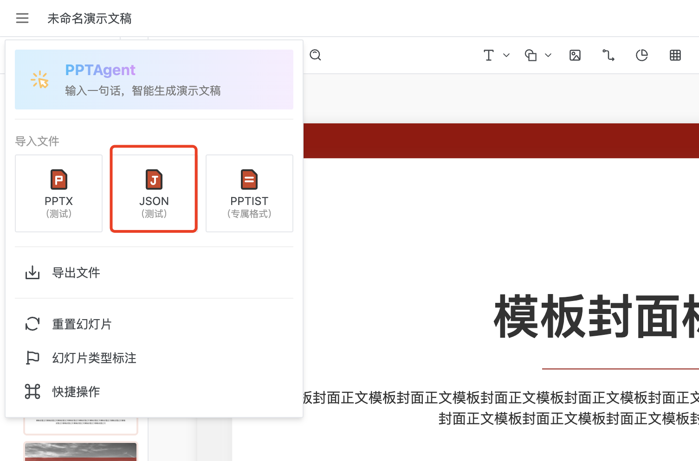
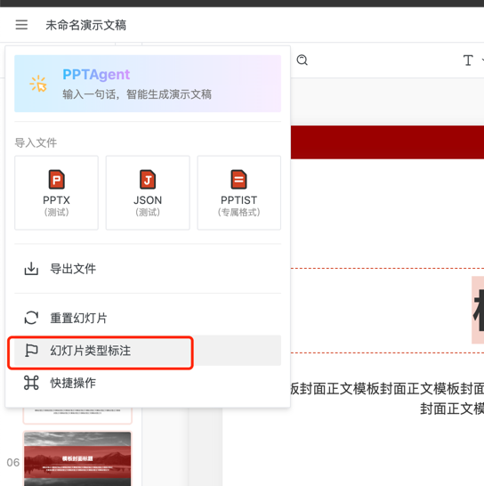
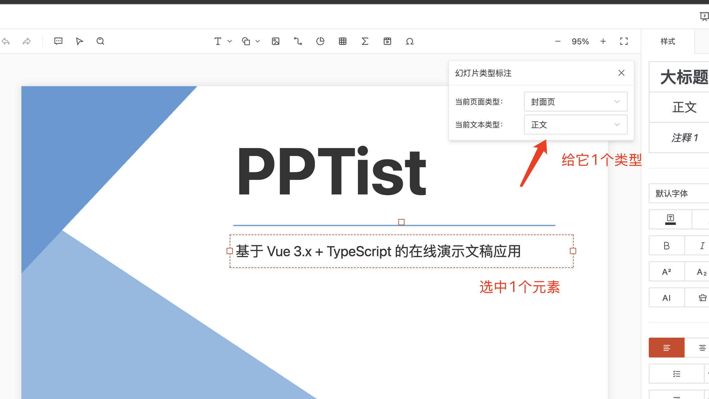
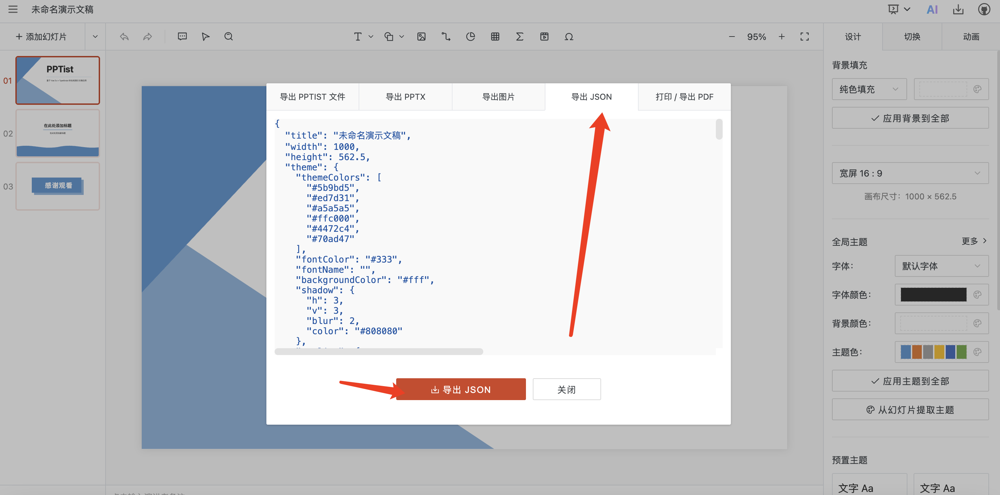

# 如何制作模版
- Step1: 启动 TeachDo 前端（`frontend`），进入 PPT 编辑器页面：
  - 工作台路径：首页选择/创建教学资料 → 进入工作台 `PPT` 标签 → 点击「进行编辑」
  - 或直接访问：`http://127.0.0.1:5174/material/{materialId}/ppt/editor`
- Step2: 点击左上角导入json,或者已有的PPT文件都可以（自己的公司的或者个人学习任何已有pptx文件)

- Step3: 点击幻灯片类型标注

- Step4: 开始标注

- Step5: 标注完成后点击左上角菜单，导出成JSON文件

- Step6: 将导出的模板放到 `backend/main_api/template/` 下，并使用统一命名（建议与 `id` 保持一致）：
  - 模板：`{id}.json`（前端会通过 `/api/data/{id}.json` 拉取）
  - 封面：`{id}.jpg`（用于 `/templates` 返回的 `cover` 展示）
- Step7: 修改backend/main_api/main.py的templates列表，添加一行你自定义的模版
```
async def get_templates():
    templates = [
        { "name": "红色通用", "id": "template_1", "cover": "/api/data/template_1.jpg" },
        { "name": "蓝色通用", "id": "template_2", "cover": "/api/data/template_2.jpg" },
        { "name": "紫色通用", "id": "template_3", "cover": "/api/data/template_3.jpg" },
        { "name": "莫兰迪配色", "id": "template_4", "cover": "/api/data/template_4.jpg" },
        # { "name": "图表", "id": "template_6", "cover": "/api/data/template_6.jpg" },
    ]
```
