# AI2PPT 项目架构详解

> 本文档详细介绍 AI2PPT 项目的整体架构、技术栈、核心模块和数据流程

## 📋 目录

- [项目概述](#项目概述)
- [整体架构](#整体架构)
- [技术栈](#技术栈)
- [后端架构](#后端架构)
- [前端架构](#前端架构)
- [核心流程](#核心流程)
- [数据流转](#数据流转)
- [部署架构](#部署架构)

---

## 项目概述

AI2PPT 是一个基于 AI 的智能 PPT 生成系统，支持通过主题或文档自动生成演示文稿。项目采用前后端分离架构，使用微服务设计，支持流式生成和实时预览。

### 核心功能

1. **智能大纲生成** - 根据主题或文档自动生成结构化大纲
2. **逐页内容生成** - 采用 SSE 流式传输实时生成 PPT 内容
3. **知识库支持** - 支持上传文档到知识库，基于知识库内容生成 PPT
4. **多模板支持** - 提供多种 PPT 模板，支持内容与样式分离
5. **在线编辑器** - 基于 Canvas 的 PPT 编辑器，支持富文本、图表、图片等元素
6. **多模型支持** - 支持 OpenAI、Anthropic、Gemini、Ollama 等多种 AI 模型

---

## 整体架构

### 系统架构图

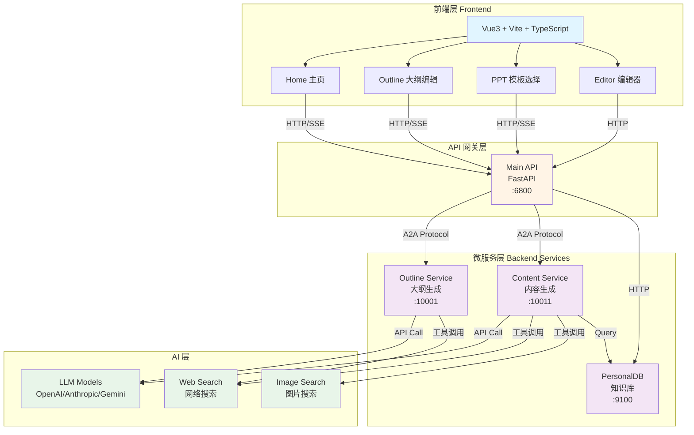

### 架构特点

- **前后端分离** - 前端 Vue3 SPA，后端 FastAPI 微服务
- **微服务架构** - 大纲生成、内容生成、知识库独立部署
- **流式传输** - 使用 SSE (Server-Sent Events) 实现实时流式响应
- **Agent 驱动** - 基于 A2A (Agent-to-Agent) 协议的 AI Agent 架构
- **模块化设计** - 各服务独立开发、部署和扩展

---

## 技术栈

### 前端技术栈

| 技术 | 版本 | 用途 |
|------|------|------|
| Vue.js | 3.5.17 | 前端框架 |
| TypeScript | 5.x | 类型系统 |
| Vite | 5.x | 构建工具 |
| Vue Router | 4.x | 路由管理 |
| Pinia | 2.x | 状态管理 |
| ProseMirror | 1.x | 富文本编辑器（多包组合） |
| ECharts | 5.5.1 | 图表渲染 |
| pptxgenjs | 3.12.0 | PPT 导出 |

### 后端技术栈

| 技术 | 版本 | 用途 |
|------|------|------|
| Python | 3.10+ | 后端语言 |
| FastAPI | 0.x | Web 框架 |
| A2A Protocol | - | Agent 通信协议 |
| ADK | - | Agent 开发工具包 |
| 工具调用 | - | 搜索/图片/知识库检索（进程内 Tool；MCP 形态可预留） |
| httpx | - | 异步 HTTP 客户端 |
| python-dotenv | - | 环境变量管理 |

### AI 模型支持

- **OpenAI** - GPT-4, GPT-3.5
- **Anthropic** - Claude 3.5 Sonnet
- **Google** - Gemini Pro
- **Ollama** - 本地模型支持
- **其他** - 支持 OpenAI 兼容接口

---

## 后端架构

### 服务组成

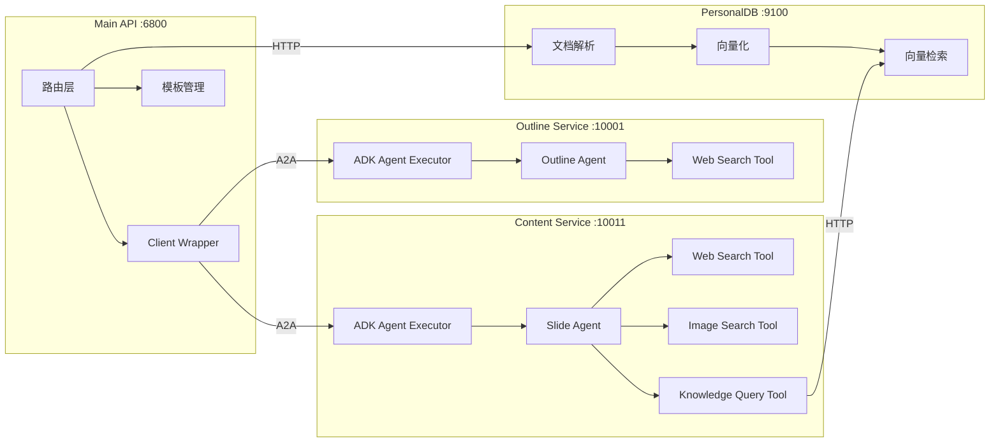

### 1. Main API (主 API 服务)

**端口**: 6800
**职责**: API 网关、请求路由、服务编排

#### 核心文件

- `main.py` - FastAPI 应用主入口
- `outline_client.py` - 大纲服务客户端封装
- `content_client.py` - 内容生成服务客户端封装
- `template/` - PPT 模板文件

#### 主要接口

| 接口 | 方法 | 功能 |
|------|------|------|
| `/tools/aippt_outline` | POST | 主题生成大纲（SSE 流式） |
| `/tools/aippt_outline_unified` | POST | 统一大纲接口：主题必填，可选上传文件（SSE 流式） |
| `/tools/aippt_outline_from_file` | POST | 文档生成大纲（SSE 流式） |
| `/tools/aippt` | POST | 生成 PPT 内容（SSE 流式） |
| `/templates` | GET | 获取模板列表 |
| `/data/{filename}` | GET | 获取模板文件 |
| `/files/{user_id}` | GET | 获取用户文档列表 |
| `/proxy` | GET | 代理上游资源 |
| `/healthz` | GET | 健康检查 |

### 2. Outline Service (大纲生成服务)

**端口**: 10001
**职责**: 根据主题或文档生成结构化大纲

#### 核心组件

- **ADK Agent Executor** - Agent 执行器
- **Outline Agent** - 大纲生成 Agent
- **Web Search Tool** - 网络搜索工具（工具调用，例如 `DocumentSearch`）

#### 工作流程

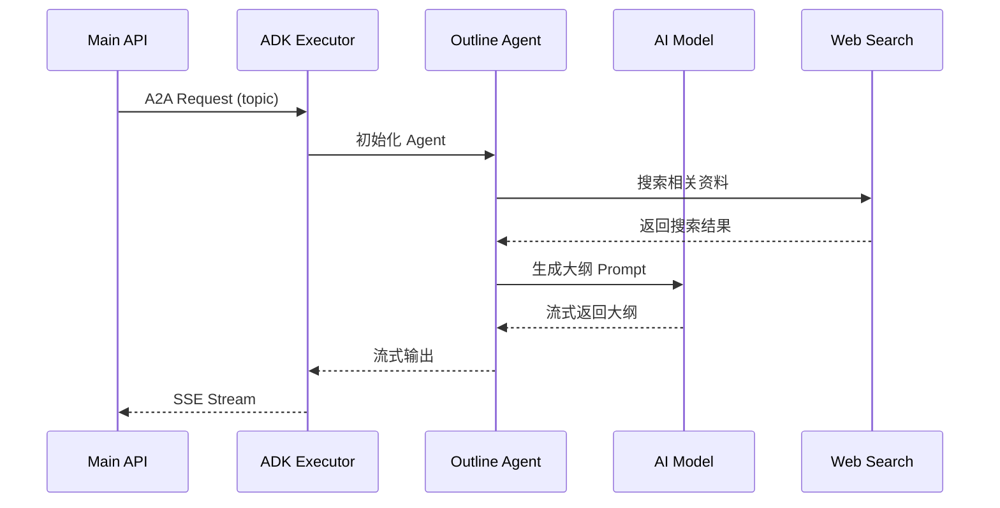

### 3. Content Service (内容生成服务)

**端口**: 10011
**职责**: 根据大纲逐页生成 PPT 内容

#### 核心组件

- **ADK Agent Executor** - Agent 执行器
- **Slide Agent** - 幻灯片内容生成 Agent
- **Web Search Tool** - 网络搜索工具
- **Image Search Tool** - 图片搜索工具
- **Knowledge Query Tool** - 知识库查询工具

#### 工作流程

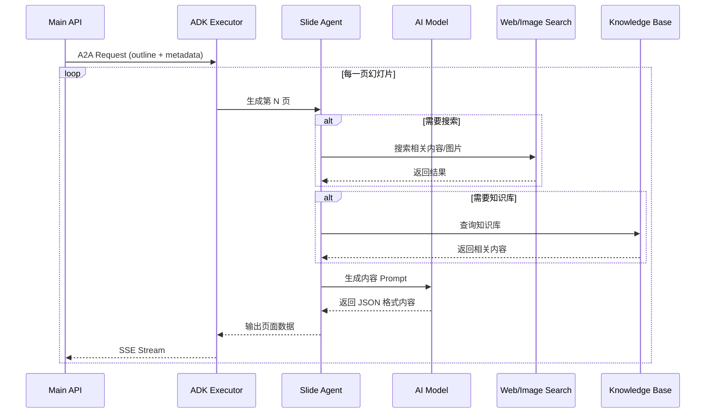

### 4. PersonalDB (知识库服务)

**端口**: 9100
**职责**: 文档解析、向量化存储、语义检索

#### 核心功能

- **文档解析** - 支持 PDF、DOCX、MD 等格式
- **向量化** - 使用 Embedding 模型生成向量
- **向量检索** - 基于语义相似度检索相关内容

#### 主要接口

| 接口 | 方法 | 功能 |
|------|------|------|
| `/upload/` | POST | 上传文档并向量化 |
| `/files/{user_id}` | GET | 获取用户文档列表 |
| `/search` | POST | 语义检索 |
| `/vectorize/text` | POST | 文本向量化 |

---

## 前端架构

### 目录结构

```
frontend/
├── src/
│   ├── assets/          # 静态资源
│   │   └── styles/      # 样式文件（设计系统）
│   ├── components/      # 公共组件
│   │   └── common/      # 设计系统组件
│   ├── configs/         # 配置文件
│   ├── hooks/           # Vue Hooks
│   ├── plugins/         # 插件
│   ├── router/          # 路由配置
│   ├── services/        # API 服务
│   ├── store/           # Pinia 状态管理
│   ├── types/           # TypeScript 类型定义
│   ├── utils/           # 工具函数
│   ├── views/           # 页面组件
│   │   ├── Home.vue     # 主页
│   │   ├── Outline/     # 大纲编辑页
│   │   ├── PPT/         # 模板选择页
│   │   └── Editor/      # PPT 编辑器
│   ├── App.vue          # 根组件
│   └── main.ts          # 入口文件
└── vite.config.ts       # Vite 配置
```

### 页面路由

```mermaid
graph LR
    A[/ Home<br/>主页] --> B[/outline<br/>大纲编辑]
    B --> C[/ppt<br/>模板选择]
    C --> D[/editor<br/>编辑器]
    A --> E[/about<br/>关于页面]
    A --> F[/app/:id?<br/>APP页面]

    style A fill:#e1f5ff
    style B fill:#fff4e6
    style C fill:#f3e5f5
    style D fill:#e8f5e9
    style E fill:#f0f0f0
    style F fill:#f0f0f0
```

### 核心页面

#### 1. Home (主页)

**路由**: `/`
**功能**: 用户输入主题或上传文档

**核心功能**:
- 主题输入模式
- 文档上传模式
- 快速选择气泡
- 语言选择（中文/English/日本語）
- 文件验证（类型、大小）

#### 2. Outline (大纲编辑页)

**路由**: `/outline`
**功能**: 流式生成大纲并支持编辑

**核心功能**:
- SSE 流式接收大纲
- Markdown 解析和渲染
- 树形结构编辑器
- 支持添加、删除、移动节点
- 4 级层级限制

#### 3. PPT (模板选择页)

**路由**: `/ppt`
**功能**: 选择 PPT 模板和生成选项

**核心功能**:
- 模板网格展示
- 模板预览图
- 单选交互
- 生成选项配置（网络搜索、知识库）

#### 4. Editor (编辑器)

**路由**: `/editor`
**功能**: 在线编辑 PPT

**核心功能**:
- Canvas 渲染引擎
- 9 种元素类型（文本、图片、形状、线条、图表、表格、LaTeX、视频、音频）
- 富文本编辑（ProseMirror）
- 图表编辑（ECharts）
- 导出 PPTX（pptxgenjs）

### 设计系统

项目采用统一的设计系统，基于 CSS Variables 实现主题切换。

#### 核心组件

| 组件 | 功能 |
|------|------|
| Button | 按钮（primary/secondary/ghost） |
| Input | 输入框（支持验证） |
| Card | 卡片（支持选中、悬停） |
| Modal | 模态框 |
| Loading | 加载动画 |
| Spinner | 旋转加载 |
| Tag | 标签 |
| Navbar | 导航栏 |
| StepProgress | 步骤进度条 |
| PageLayout | 页面布局容器 |
| Container | 内容容器 |

#### 主题系统

- **浅色主题** - 默认主题
- **深色主题** - 支持自动切换
- **CSS Variables** - 统一的设计 Token
- **响应式设计** - 支持 320px-2560px

---

## 核心流程

### 1. 主题生成 PPT 流程

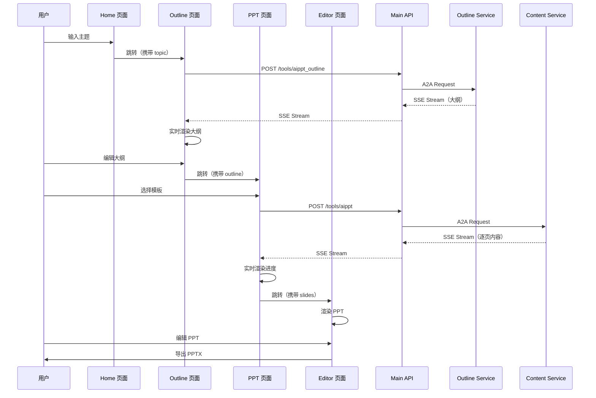

### 2. 文档生成 PPT 流程

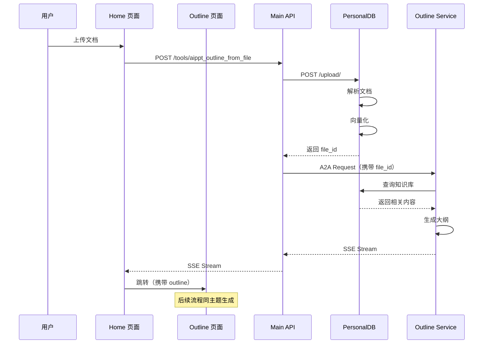

### 3. SSE 流式传输机制

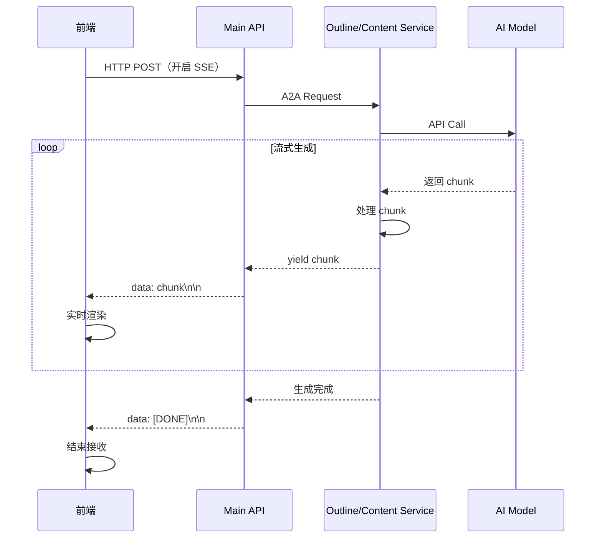

---

## 数据流转

### PPT 生成核心机制

#### 工作原理概述

AI2PPT 采用 **AI 内容生成 + 前端模板映射** 的架构：

1. **Markdown 解析** → 将大纲解析为结构化 Slide Schema
2. **AI 内容扩写** → LLM Agent 根据 Schema 扩写文本内容（输出仍为 Schema 格式）
3. **前端模板映射** → 前端将 AI 输出的 Schema 映射到模板的 elements 数组中
4. **Canvas 渲染** → 渲染引擎将 elements 渲染为可视化 PPT

#### 完整数据流图

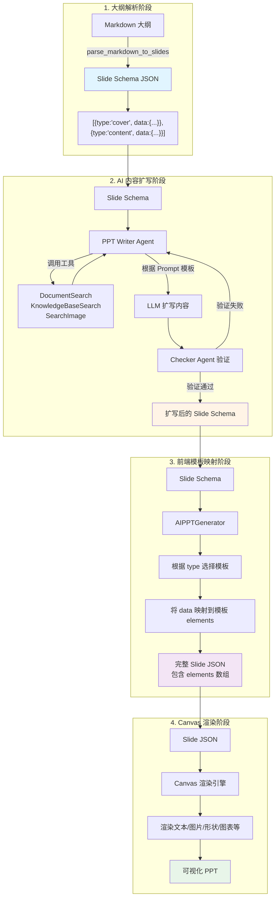

### 数据格式详解

#### 1. 大纲数据格式

**Markdown 格式** (用户输入):
```markdown
# 主标题
## 二级标题
### 三级标题
- 要点 1
- 要点 2
```

**Slide Schema JSON** (解析后):
```json
[
  {
    "type": "cover",
    "data": {
      "title": "主标题",
      "text": "A presentation generated by AI"
    }
  },
  {
    "type": "contents",
    "data": {
      "items": ["二级标题1", "二级标题2"]
    }
  },
  {
    "type": "transition",
    "data": {
      "title": "二级标题",
      "text": "Exploring the topic of ..."
    }
  },
  {
    "type": "content",
    "data": {
      "title": "三级标题",
      "items": [
        {"title": "要点 1", "text": "Detailed content..."},
        {"title": "要点 2", "text": "Detailed content..."}
      ]
    }
  },
  {
    "type": "end"
  }
]
```

**幻灯片类型说明**:
- `cover`: 封面页（包含主标题和副标题）
- `contents`: 目录页（显示所有二级标题）
- `transition`: 过渡页（章节分隔页）
- `content`: 内容页（包含标题和多个要点）
- `end`: 结束页

#### 2. AI 输出格式（Slide Schema）

**AI 输出的是 Slide Schema**，不是完整的 elements 数组：
```json
{
  "type": "cover",
  "data": {
    "title": "AI 驱动的未来",
    "text": "探索人工智能前沿技术与产业应用，助力企业数字化转型"
  },
  "images": [
    {
      "id": "img-1",
      "src": "https://example.com/image.jpg",
      "alt": "AI 技术图片"
    }
  ]
}
```

#### 3. 前端最终格式（Slide JSON）

**前端模板映射后** 生成的完整 Slide JSON：
```typescript
interface Slide {
  id: string                    // 幻灯片唯一标识
  elements: Element[]           // 元素数组（由前端模板生成）
  background?: Background       // 背景设置
}

interface Element {
  type: 'text' | 'image' | 'shape' | 'line' | 'chart' | 'table' | 'latex' | 'video' | 'audio'
  id: string                    // 元素唯一标识
  left: number                  // X 坐标
  top: number                   // Y 坐标
  width: number                 // 宽度
  height: number                // 高度
  rotate?: number               // 旋转角度
  lock?: boolean                // 是否锁定
  textType?: string             // 文本类型标记（title/content/item 等）

  // 文本元素特有属性
  content?: string              // HTML 格式内容
  defaultFontName?: string      // 默认字体
  defaultColor?: string         // 默认颜色

  // 图片元素特有属性
  src?: string                  // 图片 URL

  // 形状元素特有属性
  viewBox?: [number, number]    // SVG viewBox
  path?: string                 // SVG path
  fill?: string                 // 填充颜色

  // 图表元素特有属性
  chartType?: string            // 图表类型
  data?: any                    // 图表数据
  options?: any                 // ECharts 配置
}
```

**示例 - 封面页完整 JSON**（前端模板映射后）:
```json
{
  "id": "slide-1",
  "elements": [
    {
      "type": "shape",
      "id": "bg-1",
      "left": 0,
      "top": 0,
      "width": 1000,
      "height": 562.5,
      "fill": "rgb(155, 0, 0)",
      "lock": true
    },
    {
      "type": "text",
      "id": "title-1",
      "textType": "title",
      "left": 90,
      "top": 170,
      "width": 820,
      "height": 101,
      "content": "<p style=\"text-align: center;\"><strong><span style=\"font-size: 54px;\">AI 驱动的未来</span></strong></p>",
      "defaultColor": "#333"
    },
    {
      "type": "image",
      "id": "img-1",
      "left": 100,
      "top": 300,
      "width": 800,
      "height": 200,
      "src": "https://example.com/image.jpg"
    }
  ]
}
```

### AI 生成机制详解

#### 1. Markdown 到 Slide Schema 的映射规则

**解析规则**（`parse_markdown_to_slides` 函数）：

```python
# Markdown 层级结构
# 主标题          → 封面页（cover）
## 二级标题       → 过渡页（transition）
### 三级标题      → 内容页（content）
- 列表项         → 内容页的 items
```

**映射示例**：

```markdown
# AI 技术发展趋势

## 人工智能新突破
### 大语言模型的进化
- 多模态大模型实现文本、图像、音频的深度融合理解
- 参数效率优化，降低训练成本的同时提升性能
- 自主推理和规划能力增强，接近人类思维方式

### 生成式AI的商业应用
- 内容创作行业全面变革
- 药物研发周期缩短
```

**转换为 Slide Schema**：

```json
[
  {
    "type": "cover",
    "data": {
      "title": "AI 技术发展趋势",
      "text": "A presentation generated by AI"
    }
  },
  {
    "type": "contents",
    "data": {
      "items": ["人工智能新突破"]
    }
  },
  {
    "type": "transition",
    "data": {
      "title": "人工智能新突破",
      "text": "Exploring the topic of 人工智能新突破"
    }
  },
  {
    "type": "content",
    "data": {
      "title": "大语言模型的进化",
      "items": [
        {"title": "多模态大模型实现文本、图像、音频的深度融合理解", "text": "Detailed content..."},
        {"title": "参数效率优化，降低训练成本的同时提升性能", "text": "Detailed content..."},
        {"title": "自主推理和规划能力增强，接近人类思维方式", "text": "Detailed content..."}
      ]
    }
  },
  {
    "type": "content",
    "data": {
      "title": "生成式AI的商业应用",
      "items": [
        {"title": "内容创作行业全面变革", "text": "Detailed content..."},
        {"title": "药物研发周期缩短", "text": "Detailed content..."}
      ]
    }
  }
]
```

**关键点**：
- **一对一映射**：每个 `### 三级标题` 对应一个 content 类型的 slide
- **动态数量**：`- 列表项` 的数量决定 `items` 数组的长度
- **无数量限制**：如果大纲有 4 个小点，Schema 就会生成 4 个 items；如果有 10 个，就生成 10 个

#### 2. Prompt 模板系统

每种幻灯片类型都有对应的 Prompt 模板：

```python
prompt_mapper = {
    "cover": "封面页 Prompt 模板",
    "contents": "目录页 Prompt 模板",
    "transition": "过渡页 Prompt 模板",
    "content": "内容页 Prompt 模板",
    "end": "结束页 Prompt 模板"
}
```

**内容页 Prompt 示例**（关键约束）：

```
内容页（type: "content"）
你是技术与产业结合的内容扩写器，使用的语言是{language}。

# 核心约束：
1. 保持 data.title 与各 items[*].title 原样不改
2. 对 items[*].text 逐项扩写为 2～3 句、合计 60～120 字
3. **不得删除已有 items**
4. **不得改变顺序与数量**
5. 避免编造精确数据或过度承诺

# 可选扩展：
- 可在 data.items 末尾最多新增 1 个图表 item（kind: "chart"）
- 仅当检索到可引用的权威数据时才新增图表

# 输入 Schema：
{input_slide_data}
```

**关键机制**：
- AI **不会**删除或修改 items 的数量
- AI **只负责**扩写每个 item 的 `text` 字段
- AI **可以**在末尾新增图表（可选）

#### 4. 大纲与模板的适配机制

**问题：如果大纲有 4 个小点，但模板只有 3 个小点怎么办？**

**答案：前端模板系统会动态处理。**

**工作原理**：

1. **Schema 决定数量**
   - Markdown 大纲解析后生成的 Schema 包含实际的 items 数量
   - 例如：大纲有 4 个 `- 列表项`，Schema 就有 4 个 items

2. **AI 扩写内容**
   - AI 接收 Schema 作为输入
   - AI **只负责扩写** `data` 中的文本内容（如 `text` 字段）
   - AI 输出的仍然是 **Slide Schema 格式**，不是 elements 数组

3. **前端模板映射**
   - 前端根据 Schema 的 `type` 选择对应的模板
   - 模板中的元素通过 `textType` 标记（如 `title`、`content`、`item`）
   - 前端将 Schema 的 `data` 映射到模板元素中
   - 对于内容页，前端会**动态复制** item 模板以容纳所有 items

4. **模板的作用**
   - 模板提供**视觉布局**（元素位置、大小、样式）
   - 模板提供**样式定义**（颜色、字体、对齐方式）
   - 模板通过 `textType` 标记哪些元素需要填充内容

**实际流程示例**：

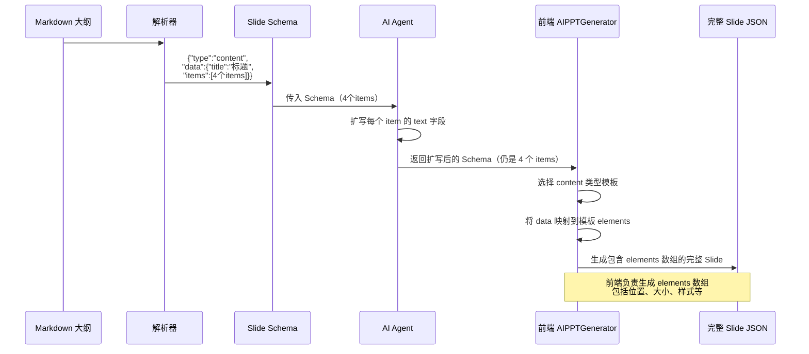

**具体示例**：

**输入 Schema**（4 个 items）：
```json
{
  "type": "content",
  "data": {
    "title": "大语言模型的进化",
    "items": [
      {"title": "多模态融合", "text": "..."},
      {"title": "参数优化", "text": "..."},
      {"title": "推理能力", "text": "..."},
      {"title": "应用落地", "text": "..."}
    ]
  }
}
```

**AI 输出**（扩写后的 Schema，格式不变）：
```json
{
  "type": "content",
  "data": {
    "title": "大语言模型的进化",
    "items": [
      {"title": "多模态融合", "text": "多模态大模型实现文本、图像、音频的深度融合理解..."},
      {"title": "参数优化", "text": "参数效率优化技术降低训练成本的同时提升性能..."},
      {"title": "推理能力", "text": "自主推理和规划能力增强，接近人类思维方式..."},
      {"title": "应用落地", "text": "在医疗、金融、教育等领域实现规模化商业应用..."}
    ]
  }
}
```

**前端生成的完整 Slide JSON**：
```json
{
  "id": "slide-1",
  "elements": [
    {"type": "text", "textType": "title", "content": "大语言模型的进化", ...},
    {"type": "text", "textType": "item", "content": "多模态融合：多模态大模型实现...", ...},
    {"type": "text", "textType": "item", "content": "参数优化：参数效率优化技术...", ...},
    {"type": "text", "textType": "item", "content": "推理能力：自主推理和规划能力...", ...},
    {"type": "text", "textType": "item", "content": "应用落地：在医疗、金融、教育...", ...},
    {"type": "shape", "fill": "#xxx", ...},
    {"type": "line", ...}
  ]
}
```

**关键点**：
- **AI 只负责内容扩写**，不生成 elements 数组
- **前端负责视觉布局**，根据模板生成 elements
- 前端会**动态调整布局**以容纳所有 items
- 模板通过 `textType` 标记实现内容与样式的分离

#### 4. 逐页生成流程

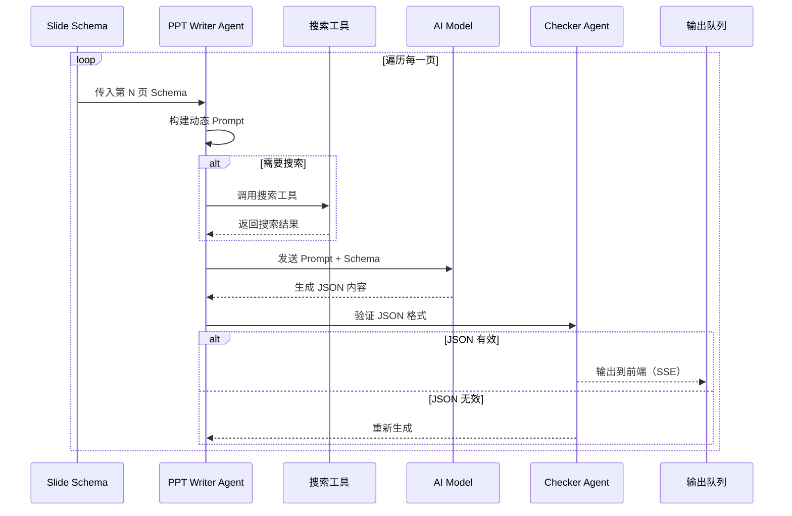

#### 5. 内容丰富策略

**基础模式**（无搜索）:
- AI 根据 Schema 中的标题和要点直接生成内容
- 适用于通用主题或不需要实时信息的场景

**网络搜索模式**:
- 调用 `DocumentSearch` 工具搜索相关资料
- AI 基于搜索结果生成更准确、更丰富的内容
- 适用于需要最新信息或专业知识的主题

**知识库模式**:
- 调用 `KnowledgeBaseSearch` 查询用户上传的文档
- AI 基于知识库内容生成定制化内容
- 适用于企业内部培训、产品介绍等场景

**图片搜索模式**:
- 调用 `SearchImage` 工具搜索相关配图
- 为每一页自动匹配合适的背景图或插图
- 提升 PPT 的视觉效果

### 大纲到 PPT 的完整映射总结

#### 映射关系表

| Markdown 层级 | Slide 类型 | 说明 | 数量限制 |
|--------------|-----------|------|---------|
| `# 主标题` | cover | 封面页 | 1 个 |
| `## 二级标题` | transition | 过渡页（章节分隔） | 多个 |
| `### 三级标题` | content | 内容页 | 多个 |
| `- 列表项` | content.items | 内容页的要点 | **无限制** |

#### 常见问题解答

**Q1: 大纲中的文本如何对应到 PPT 中的标题？**

A: 通过 Markdown 层级自动映射：
- `# 主标题` → 封面页的 `data.title`
- `## 二级标题` → 过渡页的 `data.title`
- `### 三级标题` → 内容页的 `data.title`
- `- 列表项` → 内容页的 `items[*].title`

**Q2: 如果大纲有 4 个小点，但模板只有 3 个小点怎么办？**

A: **不会有问题**，因为：
1. Schema 根据大纲动态生成，有 4 个小点就生成 4 个 items
2. AI 只负责扩写内容，输出的仍是 Schema 格式
3. **前端模板系统**会动态复制 item 模板以容纳所有 items
4. 模板提供样式参考，前端负责动态布局

**Q3: 如果大纲有 10 个小点，会不会太拥挤？**

A: 可能会拥挤，建议：
1. 在大纲编辑阶段合并相似的小点
2. 将一个三级标题拆分为多个三级标题
3. 每个内容页建议 3-5 个小点为宜

**Q4: 可以手动调整生成后的 PPT 吗？**

A: 可以，生成后可以在编辑器中：
- 添加、删除、移动元素
- 修改文本内容和样式
- 调整布局和位置
- 插入图片、图表等

**Q5: 模板的作用是什么？**

A: 模板提供：
- **视觉布局**：元素位置、大小、层级
- **样式定义**：颜色、字体、对齐方式
- **装饰元素**：背景形状、线条、图案
- **内容标记**：通过 `textType` 标记哪些元素需要填充 AI 生成的内容

**Q6: AI 和前端各自负责什么？**

A: 职责分离：
- **AI（后端）**：负责内容扩写，输出 Slide Schema（type + data 格式）
- **前端模板系统**：负责将 Schema 映射到模板 elements，生成完整的 Slide JSON
- **Canvas 渲染引擎**：负责将 Slide JSON 渲染为可视化 PPT

---

## AI Prompt 系统详解

### Prompt 架构概述

AI2PPT 的 Prompt 系统采用**分层设计**：

```
完整 Prompt = 通用约束 (PREFIX) + 页面类型 Prompt (SPECIFIC)
```

**三种通用约束模式**：
1. **基础模式**（`PREFIX_PAGE_PROMPT`）：无搜索、无图片
2. **图片搜索模式**（`PREFIX_PAGE_PROMPT_WITH_IMAGE`）：启用图片搜索
3. **全功能搜索模式**（`PREFIX_PAGE_PROMPT_WITH_SEARCH`）：启用网络搜索、知识库搜索、图片搜索

### 通用约束 Prompt

#### 1. 基础模式（无搜索）

```
# 通用约束：
1. 你将收到一段 单行 JSON，键名固定为 type 和 data（如有）。
2. 保持原有结构与键名尽量不变：**不得修改已有字段的名称**；**不得删除既有字段**。
   除非另有"内容页特例"说明，不得新增字段或改变数组长度。
3. 统一输出为{language}；专有名词可带英文小写缩写。
4. 文风：简洁、商务演示友好，避免夸张或无法证实的数字。
5. 严禁输出除 JSON 外的任何内容（包括说明、Markdown、代码块围栏）。
```

#### 2. 图片搜索模式

```
# 通用约束：
1. 你将收到一段 单行 JSON，键名固定为 type 和 data（如有）。
2. 保持原有结构与键名尽量不变：**不得修改已有字段的名称**；**不得删除既有字段**。
   除非另有"内容页特例"说明，不得新增字段或改变数组长度。
3. 统一输出为{language}；专有名词可带英文小写缩写。
4. 文风：简洁、商务演示友好，避免夸张或无法证实的数字。
5. 严禁输出除 JSON 外的任何内容（包括说明、Markdown、代码块围栏）。

# 重要：图片搜索工具使用
你必须为每个页面搜索合适的配图！使用 SearchImage 工具搜索相关图片，然后将图片信息添加到返回的 JSON 中。

# 图片搜索规则：
- 封面页：搜索与主题相关的商务、抽象或科技类图片，关键词如 "business abstract"、"technology background"
- 内容页：根据内容主题搜索相关图片，如技术类内容搜索 "technology"、"innovation"
- 过渡页：搜索抽象或商务类图片，关键词如 "abstract background"、"business concept"
- 结束页：搜索简洁的商务或抽象图片，关键词如 "minimal business"、"clean abstract"

# 图片数据格式：
在 JSON 中添加 images 字段，包含搜索到的图片信息：
{
  "type": "cover",
  "data": { ... },
  "images": [
    {
      "id": "图片ID",
      "src": "图片URL",
      "alt": "图片描述"
    }
  ]
}
```

#### 3. 全功能搜索模式

```
# 通用约束：
1. 你将收到一段 单行 JSON，键名固定为 type 和 data（如有）。
2. 保持原有结构与键名尽量不变：**不得修改已有字段的名称**；**不得删除既有字段**。
   除非另有"内容页特例"说明，不得新增字段或改变数组长度。
3. 必须使用搜索工具{tool_names}进行搜索，然后完成内容扩充。
4. 统一输出为{language}；专有名词可带英文小写缩写。
5. 文风：简洁、商务演示友好，避免夸张或无法证实的数字。
6. 严禁输出除 JSON 外的任何内容（包括说明、Markdown、代码块围栏）。
```

### 页面类型 Prompt

#### 1. 封面页（cover）

```
封面页（type: "cover"）
你是PPT封面文案优化器,使用的语言是{language}。
保持 title 原样，不改；
重写 data.text 为 18～32 字的副标题，强调主题价值与适用场景，避免标点堆叠与口号化。

{input_slide_data}
```

**输入示例**：
```json
{
  "type": "cover",
  "data": {
    "title": "AI 技术发展趋势",
    "text": "A presentation generated by AI"
  }
}
```

**输出示例**：
```json
{
  "type": "cover",
  "data": {
    "title": "AI 技术发展趋势",
    "text": "探索人工智能前沿技术与产业应用，助力企业数字化转型与创新发展"
  }
}
```

#### 2. 目录页（contents）

```
目录页（type: "contents"）
你是PPT目录优化器,使用的语言是{language}。
仅在需要时对 data.items[*] 的短语做轻微润色（可名词化或动宾化，使其更像目录条目），
不得改变顺序与数量；每项不超过14个字；不添加或删除项目。

{input_slide_data}
```

**关键约束**：
- 不改变顺序
- 不改变数量
- 每项不超过 14 字
- 轻微润色，使其更像目录条目

#### 3. 过渡页（transition）

```
过渡页（type: "transition"）
你是章节过渡文案撰写者,使用的语言是{language}。
保持 data.title 原样不改；
重写 data.text 为2～3句过渡语，每句12～24字，
说明本章为何重要、将回答什么问题、读者可获得的收获。
避免夸张或口号化表达。

{input_slide_data}
```

**输出要求**：
- 2～3 句过渡语
- 每句 12～24 字
- 说明重要性、问题、收获

#### 4. 内容页（content）- 基础版

```
内容页（type: "content"）
你是技术与产业结合的内容扩写器。
保持 data.title 与各 items[*].title 原样不改；
对 items[*].text 逐项扩写为 2～3 句、合计 60～120 字，
采用"是什么→为何重要→如何落地/示例"的逻辑；
不得删除已有 items；
避免编造精确数据或过度承诺。

# 原始结构
{input_slide_data}
```

#### 5. 内容页（content）- 带图表版

```
内容页（type: "content"）
你是技术与产业结合的内容扩写器，使用的语言是{language}。
保持 data.title 与各 items[*].title 原样不改；
对 items[*].text 逐项扩写为 2～3 句、合计 60～120 字，
采用"是什么→为何重要→如何落地/示例"的逻辑；
不得删除已有 items；
避免编造精确数据或过度承诺。

# 图表（严格防止编造）：
仅当本页主题涉及趋势/对比/占比/量化指标，且通过检索获得"可引用的权威来源数据"时，
才允许在 data.items **末尾**新增 1 个 `{"kind":"chart", ...}` 项；
否则**不要**新增图表。

- **来源要求**：使用的数据**必须来自工具返回的原文内容**。
- **数据要求**：所有数值必须与来源一致；不得估算/外推/上色演示。
- **类型选择**：时间趋势用 line，类目对比用 bar，占比用 pie。
- **找不到即拒绝**：若未找到可引用数据，保持原结构不变，
  并在本页末尾追加一句固定话术："未检索到可引用的数据，故不新增图表。"
- **字段限制**：不得新增 chart 以外的其他字段。

# 输出结构（不得变更）：
- 原始结构（type、data）保持不变；
- 你可以在 data.items 中**最多新增 1 个**图表 item（不替换已存在文本 item）；
- 图表 item 的 JSON 结构**扩展为**（以下附加字段为必填）：
{
  "kind": "chart",                                    # 必填，固定字符串 "chart"
  "title": "图表标题",                                # 建议 ≤ 16 字，不要添加来源信息
  "text": "图表的描述信息",                             # 建议 ≤ 40 字，不要添加来源信息
  "chartType": "line" | "bar" | "pie" | "column" | "ring" | "area" | "radar",
  "labels": ["类目或时间刻度", ...],                    # 4~8 个，均为字符串
  "series": [                                           # 1~2 组数据
    { "name": "系列名", "data": [数值, ...] }         # data 长度与 labels 一致，均为数字
  ],
  "options": {
      "xAxis": { "name": "xxx" },
      "yAxis": { "name": "xxx" }
  },
}

# 检索与证据：
- 先检索再写作。
- 图表以外的内容若涉及定量描述，需加"区间/范围/定性词"，避免精确值。

# 何时应当新增图表：
- 仅当存在可视化价值且**找到了**可利用数据；否则不要新增图表。

# 原始结构
{input_slide_data}
```

**图表生成示例**：

**输入 Schema**：
```json
{
  "type": "content",
  "data": {
    "title": "AI 市场规模增长",
    "items": [
      {"title": "全球市场快速扩张", "text": "..."},
      {"title": "中国市场领先增长", "text": "..."}
    ]
  }
}
```

**输出（新增图表）**：
```json
{
  "type": "content",
  "data": {
    "title": "AI 市场规模增长",
    "items": [
      {"title": "全球市场快速扩张", "text": "全球人工智能市场规模持续扩大..."},
      {"title": "中国市场领先增长", "text": "中国AI市场增速领先全球..."},
      {
        "kind": "chart",
        "title": "全球AI市场规模趋势",
        "text": "2020-2025年全球AI市场规模增长趋势",
        "chartType": "line",
        "labels": ["2020", "2021", "2022", "2023", "2024", "2025"],
        "series": [
          {"name": "市场规模（亿美元）", "data": [500, 750, 1100, 1600, 2300, 3200]}
        ],
        "options": {
          "xAxis": {"name": "年份"},
          "yAxis": {"name": "市场规模（亿美元）"}
        }
      }
    ]
  }
}
```

#### 6. 结束页（end）

```
结束页（type: "end"）
你是PPT结束页生成器,使用的语言是{language}。
若无 data 字段则原样返回；
若存在 data.text，则改写为10～16字的感谢语，
语气真诚克制，可包含"感谢观看/欢迎交流"等，不添加多余字段。

{input_slide_data}
```

### Prompt 设计原则

#### 1. 结构保持原则

**核心约束**：
- 不得修改已有字段的名称
- 不得删除既有字段
- 不得改变数组长度（除内容页可新增图表）

**原因**：
- 确保前端能正确解析 JSON
- 保持数据结构的一致性
- 避免 AI 随意修改结构导致渲染失败

#### 2. 内容质量原则

**文风要求**：
- 简洁、商务演示友好
- 避免夸张或无法证实的数字
- 避免标点堆叠与口号化

**内容扩写逻辑**：
- 是什么（定义）
- 为何重要（价值）
- 如何落地/示例（应用）

#### 3. 数据真实性原则

**图表生成约束**：
- 数据必须来自工具返回的原文内容
- 不得估算、外推、编造数据
- 找不到数据就不生成图表

**定量描述约束**：
- 使用区间/范围/定性词
- 避免精确值（除非来自可靠来源）

#### 4. 输出格式原则

**严格约束**：
- 严禁输出除 JSON 外的任何内容
- 不输出说明、Markdown、代码块围栏
- 确保 JSON 格式正确，可被解析

### Prompt 配置

**环境变量控制**：

```python
# 是否启用图表生成
USE_CHART=True  # 启用带图表的内容页 Prompt
USE_CHART=False # 使用基础版内容页 Prompt
```

**工具配置**：

```python
# 可用的搜索工具
search_engine = [
    "DocumentSearch",        # 网络搜索
    "KnowledgeBaseSearch",   # 知识库搜索
    "SearchImage"            # 图片搜索
]
```

### Prompt 使用流程

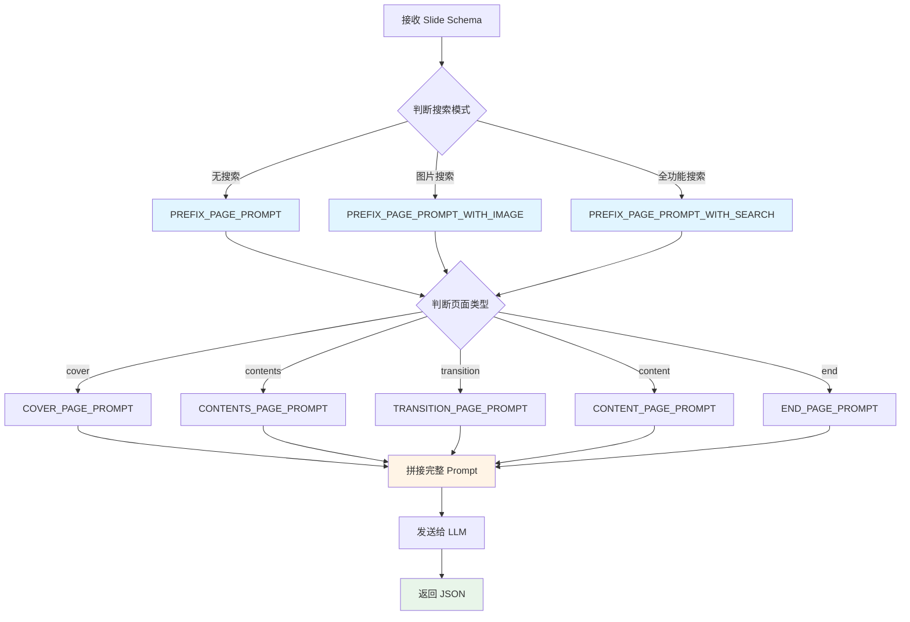

### 数据传递方式

| 阶段 | 传递方式 | 数据格式 | 数据内容 |
|------|---------|---------|---------|
| Home → Outline | URL Query | String | topic, language, model |
| Outline → PPT | sessionStorage | Markdown | 完整大纲文本 |
| PPT → Editor | sessionStorage | JSON | Slide[] 数组 |
| Backend SSE | Server-Sent Events | JSON | 逐页流式传输 |

### 与传统模板方式的对比

| 特性 | 传统模板替换 | AI2PPT 智能生成 |
|------|-------------|----------------|
| 内容生成 | 简单占位符替换 | AI 智能扩写内容 |
| 布局生成 | 固定模板布局 | 前端动态映射到模板 |
| 灵活性 | 受限于模板结构 | 前端可动态调整布局 |
| 内容质量 | 依赖用户输入 | AI 自动扩充、润色 |
| 图片处理 | 手动插入 | 自动搜索匹配 |
| 知识库集成 | 不支持 | 原生支持 |
| 实时信息 | 不支持 | 网络搜索支持 |

### PPTX 导出机制

#### 导出流程概述

AI2PPT 使用 **pptxgenjs** 库在浏览器端直接生成标准的 PPTX 文件，无需服务器端处理。

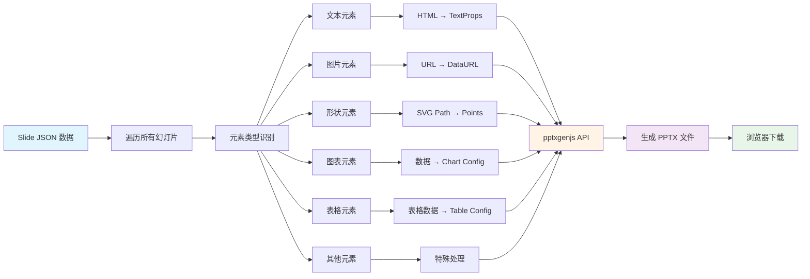

#### 核心转换逻辑

**1. 文本元素转换**

将 HTML 富文本转换为 pptxgenjs 的 TextProps 格式：

```typescript
// HTML 输入
<p style="text-align: center;">
  <strong><span style="font-size: 54px;">标题</span></strong>
</p>

// 转换为 pptxgenjs 格式
[
  {
    text: "标题",
    options: {
      fontSize: 54,
      bold: true,
      align: "center"
    }
  }
]
```

**支持的文本样式**：
- 字体大小、颜色、字体族
- 粗体、斜体、下划线、删除线
- 上标、下标
- 文本对齐、缩进
- 列表（有序/无序）
- 超链接

**2. 图片元素转换**

处理各种图片来源：

```typescript
// Base64 图片：直接使用
if (isBase64Image(el.src)) {
  options.data = el.src
}
// 外链图片：通过代理转为 DataURL
else {
  options.data = await getSafeImageDataURL(el.src)
}
```

**图片处理特性**：
- 支持裁剪（crop）
- 支持翻转（flipH/flipV）
- 支持旋转（rotate）
- 支持透明度
- 外链图片通过代理服务器获取（避免跨域问题）

**3. 形状元素转换**

将 SVG 路径转换为 pptxgenjs 的 Points 格式：

```typescript
// SVG Path
"M 0 0 L 200 0 L 200 200 L 0 200 Z"

// 转换为 Points
[
  { x: 0, y: 0, moveTo: true },
  { x: 2.08, y: 0 },
  { x: 2.08, y: 2.08 },
  { x: 0, y: 2.08 },
  { close: true }
]
```

**形状处理特性**：
- 支持自定义 SVG 路径
- 支持填充颜色和渐变
- 支持边框样式（实线/虚线/点线）
- 支持阴影效果
- 支持形状内文本

**4. 图表元素转换**

将图表数据转换为 pptxgenjs 的图表配置：

```typescript
// 图表数据
{
  labels: ["Q1", "Q2", "Q3", "Q4"],
  series: [[10, 20, 30, 40], [15, 25, 35, 45]]
}

// 转换为 pptxgenjs 格式
[
  {
    name: "系列1",
    labels: ["Q1", "Q2", "Q3", "Q4"],
    values: [10, 20, 30, 40]
  },
  {
    name: "系列2",
    labels: ["Q1", "Q2", "Q3", "Q4"],
    values: [15, 25, 35, 45]
  }
]
```

**支持的图表类型**：
- 柱状图（bar）
- 条形图（column）
- 折线图（line）
- 面积图（area）
- 饼图（pie）
- 环形图（ring）
- 雷达图（radar）
- 散点图（scatter）

**5. 表格元素转换**

处理表格数据和样式：

```typescript
// 表格数据
[
  [
    { text: "标题1", colspan: 1, rowspan: 1, style: {...} },
    { text: "标题2", colspan: 1, rowspan: 1, style: {...} }
  ],
  [
    { text: "内容1", colspan: 1, rowspan: 1, style: {...} },
    { text: "内容2", colspan: 1, rowspan: 1, style: {...} }
  ]
]
```

**表格处理特性**：
- 支持合并单元格（colspan/rowspan）
- 支持单元格样式（字体、颜色、对齐）
- 支持表格主题（行/列头、行/列尾）
- 支持边框样式

**6. 其他元素**

- **LaTeX 公式**：将 SVG 渲染结果转为 Base64 图片
- **视频/音频**：嵌入媒体文件（支持 mp4、mp3 等格式）
- **线条**：支持箭头、虚线样式

#### 单位转换

pptxgenjs 使用英寸和磅作为单位，需要从像素转换：

```typescript
// 像素 → 英寸
const ratioPx2Inch = 96 * (viewportSize / 960)

// 像素 → 磅
const ratioPx2Pt = 96 / 72 * (viewportSize / 960)

// 使用示例
x: el.left / ratioPx2Inch,      // 位置
fontSize: size / ratioPx2Pt,    // 字体大小
```

#### 代理服务器

为了解决跨域问题，外链资源通过代理服务器获取：

```typescript
// 代理端点
const PROXY_ENDPOINT = '/api/proxy'

// 代理 URL
function toProxyUrl(url: string) {
  return `${PROXY_ENDPOINT}?url=${encodeURIComponent(url)}`
}

// 获取图片 DataURL
async function getSafeImageDataURL(src: string): Promise<string> {
  const finalUrl = toProxyUrl(src)
  const res = await fetch(finalUrl)
  const blob = await res.blob()
  return await blobToDataURL(blob)
}
```

#### 导出选项

用户可以选择导出选项：

- **masterOverwrite**: 是否覆盖母版样式
- **ignoreMedia**: 是否忽略视频/音频元素

#### 支持的导出格式

| 格式 | 说明 | 用途 |
|------|------|------|
| PPTX | PowerPoint 格式 | 标准演示文稿，可在 Office 中编辑 |
| JSON | JSON 格式 | 数据备份、程序处理 |
| PPTIST | 专有格式 | AI2PPT 内部格式（加密） |
| PNG/JPEG | 图片格式 | 单页导出为图片 |

#### 技术优势

1. **纯前端实现**：无需服务器端处理，减轻服务器负担
2. **标准格式**：生成的 PPTX 文件完全兼容 Microsoft PowerPoint
3. **完整支持**：支持 9 种元素类型和丰富的样式
4. **跨域处理**：通过代理服务器解决外链资源跨域问题
5. **高保真度**：精确还原 Canvas 渲染效果

### PPTX 导入与模板系统

#### PPTX 导入机制

AI2PPT 支持将现有的 PPTX 文件导入到编辑器中进行编辑和标注。

**导入流程**：

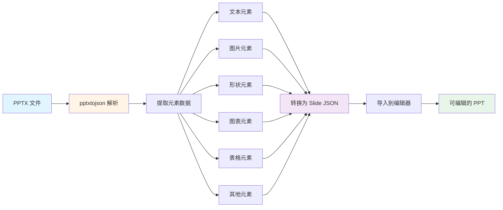

**核心技术**：
- 使用 **pptxtojson** 库解析 PPTX 文件
- 将 PPTX 的 XML 结构转换为项目内部的 JSON 格式
- 支持单位转换（磅 → 像素）
- 支持样式映射（PPTX 样式 → 项目样式）

**支持的导入元素**：
- 文本（包括富文本样式）
- 图片（包括裁剪、翻转、旋转）
- 形状（包括自定义 SVG 路径）
- 图表（8 种图表类型）
- 表格（包括合并单元格）
- 线条（包括箭头、虚线）
- 视频/音频
- LaTeX 公式（转为图片）
- 组合元素

#### 模板系统工作原理

**模板文件结构**：

```json
{
  "title": "模板名称",
  "width": 1000,
  "height": 562.5,
  "theme": { ... },
  "slides": [
    {
      "id": "slide-1",
      "elements": [
        {
          "type": "text",
          "id": "text-1",
          "content": "<p>模板封面标题</p>",
          "textType": "title",  // 关键字段：标识此文本需要被 AI 替换
          ...
        },
        {
          "type": "text",
          "id": "text-2",
          "content": "<p>模板封面正文</p>",
          "textType": "content",  // 关键字段：标识此文本需要被 AI 替换
          ...
        }
      ]
    }
  ]
}
```

**textType 字段说明**：
- `title`: 标题文本（会被 AI 生成的标题替换）
- `content`: 正文文本（会被 AI 生成的内容替换）
- 无 `textType`: 装饰性文本（不会被替换，保持原样）

**系统使用模板的流程（当前实现）**：

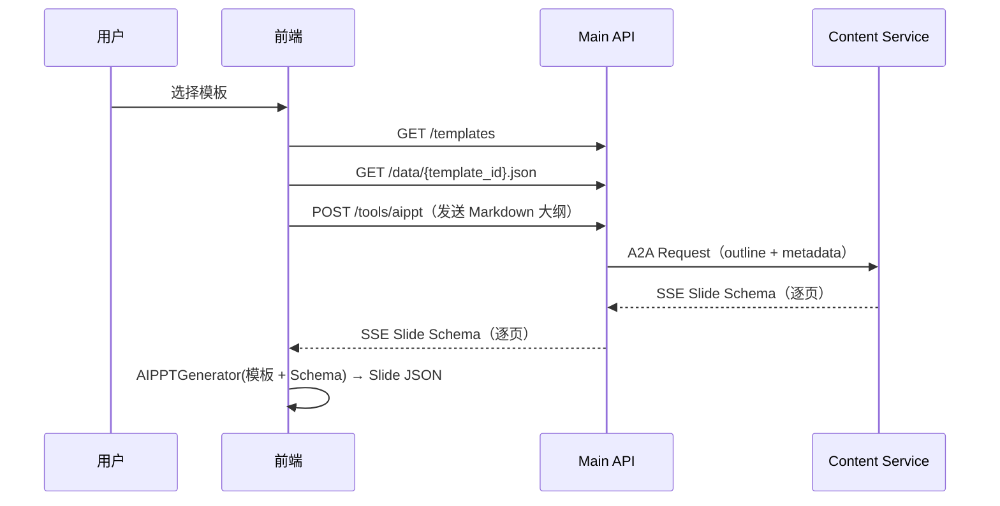

#### 导入的 PPT 能否作为模板？

**答案：理论上可以，但需要手动处理。**

**当前限制**：
1. 导入的 PPTX 转换后的 JSON **没有** `textType` 字段
2. AI Agent 依赖 `textType` 字段来识别哪些文本需要替换
3. 没有 `textType` 的文本会被视为装饰性元素，保持原样

**如何将导入的 PPT 转为模板**：

#### 方法一：使用可视化标注面板（推荐）

AI2PPT 提供了**可视化标注面板**，无需手动编辑 JSON 文件。

**操作步骤**：

1. **导入 PPTX 文件**
   - 在编辑器中点击"导入"按钮
   - 选择要转换为模板的 PPTX 文件
   - 系统自动解析并导入到编辑器

2. **使用标注面板标注元素**
   - 打开"幻灯片类型标注"面板（MarkupPanel）
   - 标注每一页的类型：
     - 封面页（cover）
     - 目录页（contents）
     - 过渡页（transition）
     - 内容页（content）
     - 引用页（reference）
     - 结束页（end）
   - 选中文本元素，标注文本类型：
     - 标题（title）
     - 副标题（subtitle）
     - 正文（content）
     - 列表项目（item）
     - 列表项标题（itemTitle）
     - 注释（notes）
     - 页眉（header）
     - 页脚（footer）
   - 选中图片元素，标注图片类型：
     - 页面插图（pageFigure）
     - 项目插图（itemFigure）
     - 背景图（background）
   - 选中图表元素，标注图表标记：
     - 图表（内容项）（item）

3. **导出为 JSON 格式**
   - 点击"导出" → "JSON"
   - 保存 JSON 文件

4. **保存到模板目录**
   ```bash
   # 将 JSON 文件保存到模板目录
   cp my-template.json backend/main_api/template/template_5.json
   
   # 添加模板预览图
   cp my-template-preview.jpg backend/main_api/template/template_5.jpg
   ```

5. **注册模板**
   ```python
   # 在 backend/main_api/main.py 中注册
   @app.get("/templates")
   async def get_templates():
       templates = [
           { "name": "我的模板", "id": "template_5", "cover": "/api/data/template_5.jpg" },
       ]
       return {"data": templates}
   ```

**标注面板界面**：

```
┌─────────────────────────────────┐
│ 幻灯片类型标注                    │
├─────────────────────────────────┤
│ 当前页面类型：[封面页 ▼]          │
│ 当前文本类型：[标题 ▼]            │
└─────────────────────────────────┘
```

**标注后的 JSON 示例**：

```json
{
  "id": "slide-1",
  "type": "cover",  // 页面类型标注
  "elements": [
    {
      "type": "text",
      "id": "text-1",
      "content": "<p>AI 技术发展趋势</p>",
      "textType": "title",  // 文本类型标注（自动添加）
      ...
    },
    {
      "type": "text",
      "id": "text-2",
      "content": "<p>探索人工智能前沿技术</p>",
      "textType": "subtitle",  // 副标题标注
      ...
    },
    {
      "type": "image",
      "id": "img-1",
      "src": "...",
      "imageType": "background",  // 图片类型标注
      ...
    }
  ]
}
```

#### 方法二：手动编辑 JSON（不推荐）

如果不使用标注面板，也可以手动编辑 JSON 文件：

1. **导入 PPTX 文件**
   ```typescript
   // 在编辑器中导入 PPTX
   importPPTXFile(files)
   ```

2. **导出为 JSON 格式**
   ```typescript
   // 导出当前 PPT 为 JSON
   exportJSON()
   ```

3. **手动添加标注字段**
   ```json
   {
     "type": "text",
     "content": "<p>这是标题</p>",
     "textType": "title",  // 手动添加此字段
     ...
   }
   ```

4. **保存到模板目录**
   ```bash
   # 将 JSON 文件保存到模板目录
   cp my-template.json backend/main_api/template/template_5.json
   ```

5. **注册模板**
   ```python
   # 在 backend/main_api/main.py 中注册
   @app.get("/templates")
   async def get_templates():
       templates = [
           { "name": "我的模板", "id": "template_5", "cover": "/api/data/template_5.jpg" },
       ]
       return {"data": templates}
   ```

**模板设计建议**：

1. **明确标识可替换文本**
   - 为需要 AI 生成的文本添加 `textType: "title"` 或 `textType: "content"`
   - 装饰性文本不添加 `textType`

2. **保持布局一致性**
   - 每种幻灯片类型（封面、目录、内容、过渡、结束）至少设计一个版本
   - 确保元素位置、大小合理

3. **使用占位符文本**
   - 标题使用 "模板封面标题"、"模板内容页标题" 等
   - 正文使用 "模板封面正文..." 等长文本

4. **考虑多语言支持**
   - 预留足够的文本空间
   - 避免固定宽度的文本框

#### 标注完成后的使用

**是的！标注完成的 PPT 可以直接作为模板使用。**

**工作流程**：

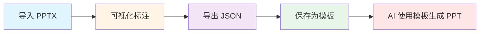

**关键优势**：

1. **无需手动编辑 JSON**
   - 可视化界面操作，简单直观
   - 实时预览标注效果
   - 避免 JSON 格式错误

2. **完整的标注系统**
   - 页面类型标注（6 种类型）
   - 文本类型标注（12 种类型）
   - 图片类型标注（3 种类型）
   - 图表标记（1 种类型）

3. **灵活的模板设计**
   - 可以标注任意 PPTX 文件
   - 支持复杂的布局和样式
   - 保留所有装饰性元素

**标注类型完整列表**：

| 类别 | 标注类型 | 值 | 说明 |
|------|---------|-----|------|
| **页面类型** | 封面页 | cover | 主标题页 |
| | 目录页 | contents | 章节目录 |
| | 过渡页 | transition | 章节分隔 |
| | 内容页 | content | 主要内容 |
| | 引用页 | reference | 参考文献 |
| | 结束页 | end | 感谢页 |
| **文本类型** | 标题 | title | 页面主标题 |
| | 副标题 | subtitle | 页面副标题 |
| | 正文 | content | 正文内容 |
| | 列表项目 | item | 列表项内容 |
| | 列表项标题 | itemTitle | 列表项标题 |
| | 注释 | notes | 注释说明 |
| | 页眉 | header | 页眉文本 |
| | 页脚 | footer | 页脚文本 |
| | 节编号 | partNumber | 章节编号 |
| | 项目编号 | itemNumber | 项目编号 |
| | 引用编号 | referenceNumber | 引用编号 |
| | PMID | pmid | 医学文献编号 |
| | URL | url | 网址链接 |
| | DOI | doi | 数字对象标识符 |
| | 引用标题 | text | 引用标题 |
| **图片类型** | 页面插图 | pageFigure | 页面级插图 |
| | 项目插图 | itemFigure | 项目级插图 |
| | 背景图 | background | 背景图片 |
| **图表标记** | 图表（内容项） | item | 内容项图表 |

**未来改进方向**：

1. **自动识别 textType**
   - 根据文本位置、大小、样式自动推断 textType
   - 减少手动标注工作量

2. **模板管理界面**
   - 在前端提供模板上传、编辑、预览功能
   - 一键发布为模板

3. **模板市场**
   - 用户可以分享自己设计的模板
   - 支持模板评分和下载

4. **批量标注**
   - 支持批量选择元素进行标注
   - 智能推荐标注类型

---

## 部署架构

### 开发环境

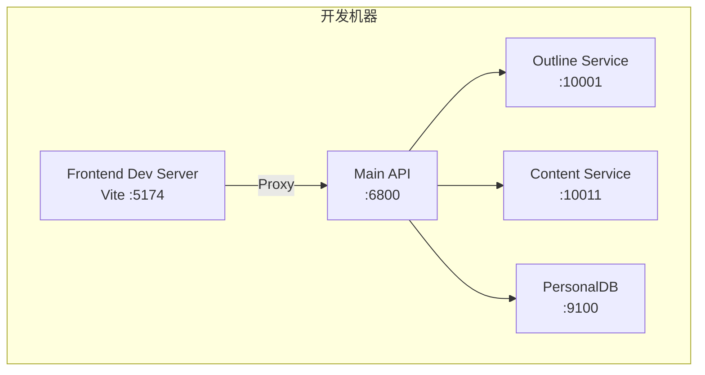

**启动命令**:
```bash
# 前端（TeachDo）
cd teachdo-frontend && npm run dev

# 后端（方式一：一键启动）
cd backend && python start_backend.py

# 后端（方式二：分别启动）
cd backend/main_api && python main.py
cd backend/simpleOutline && python main_api.py
cd backend/slide_agent && python main_api.py
cd backend/personaldb && python main.py
```

### 生产环境

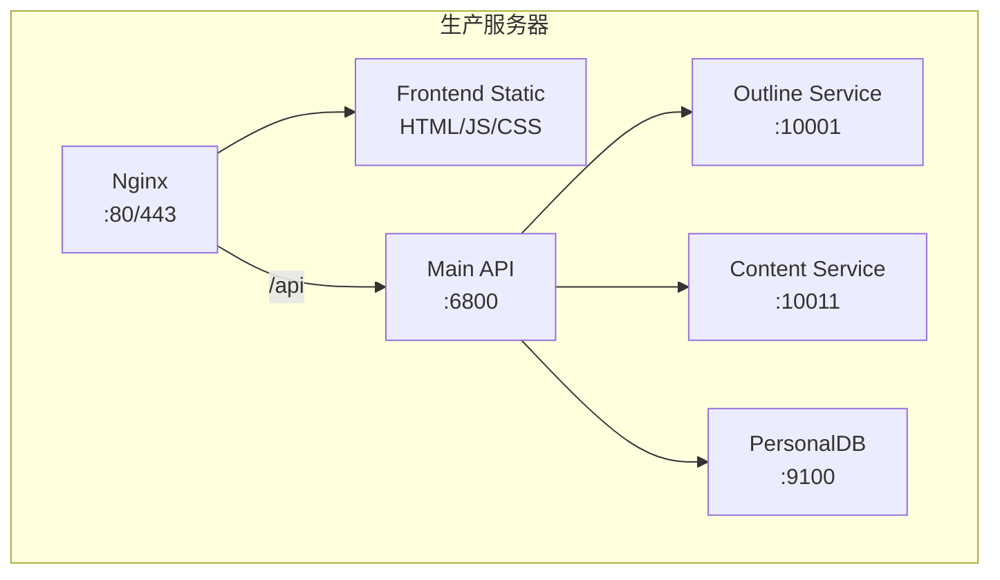

**部署方式**:

1. **一键部署**:
```bash
python start.py
```

2. **Docker Compose**:
```bash
docker compose up
```

### 环境变量配置

**根目录 `.env`** (示例配置，实际可使用不同的 API 提供商):
```env
# 大纲生成模型
OUTLINE_TYPE=openai
OUTLINE_BASE_URL=https://api.openai.com/v1
OUTLINE_API_KEY=sk-xxx
OUTLINE_MODEL=gpt-4

# 内容生成模型
PPT_WRITER_TYPE=openai
PPT_WRITER_BASE_URL=https://api.openai.com/v1
PPT_WRITER_API_KEY=sk-xxx
PPT_WRITER_MODEL=gpt-4

# 内容校对模型（可选，可与 Writer 保持一致）
PPT_CHECKER_TYPE=openai
PPT_CHECKER_BASE_URL=https://api.openai.com/v1
PPT_CHECKER_API_KEY=sk-xxx
PPT_CHECKER_MODEL=gpt-4

# 向量嵌入模型
EMBEDDING_TYPE=openai
EMBEDDING_BASE_URL=https://api.openai.com/v1
EMBEDDING_API_KEY=sk-xxx
EMBEDDING_MODEL=text-embedding-3-small

# 服务端口
OUTLINE_API=http://127.0.0.1:10001
CONTENT_API=http://127.0.0.1:10011
PERSONAL_DB=http://127.0.0.1:9100

# 其他配置
USE_CHART=True  # 是否启用图表生成
```

**说明**：
- 所有 `*_TYPE` 字段表示协议类型（openai/claude/google/ollama）
- 支持使用 OpenAI 兼容接口（如 SiliconFlow、DeepSeek 等）
- 可以为不同服务配置不同的模型和 API 端点

---

## 总结

AI2PPT 项目采用现代化的前后端分离架构，通过微服务设计实现了高度的模块化和可扩展性。核心特点包括：

1. **微服务架构** - 大纲生成、内容生成、知识库独立部署
2. **流式传输** - SSE 实现实时响应，提升用户体验
3. **Agent 驱动** - 基于 A2A 协议的 AI Agent 架构
4. **内容与布局分离** - AI 负责内容扩写，前端负责模板映射和视觉布局
5. **多模型支持** - 灵活配置不同的 AI 模型
6. **知识库集成** - 支持文档上传和语义检索

### 核心架构说明

PPT 生成采用 **AI 内容扩写 + 前端模板映射** 的架构：
- **AI（后端）**：接收 Slide Schema，扩写文本内容，输出仍为 Schema 格式
- **前端模板系统**：将 Schema 映射到模板 elements，生成完整的 Slide JSON
- **Canvas 渲染引擎**：将 Slide JSON 渲染为可视化 PPT

这种设计实现了内容生成与视觉呈现的解耦，使系统更加灵活和可维护。

项目已完成前端重构（阶段 1-4、7），采用了现代化的设计系统和组件化开发，代码质量和可维护性显著提升。
