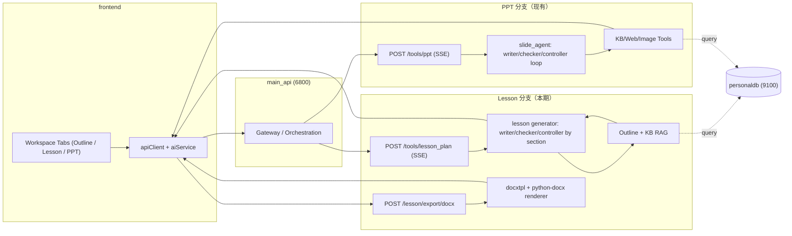
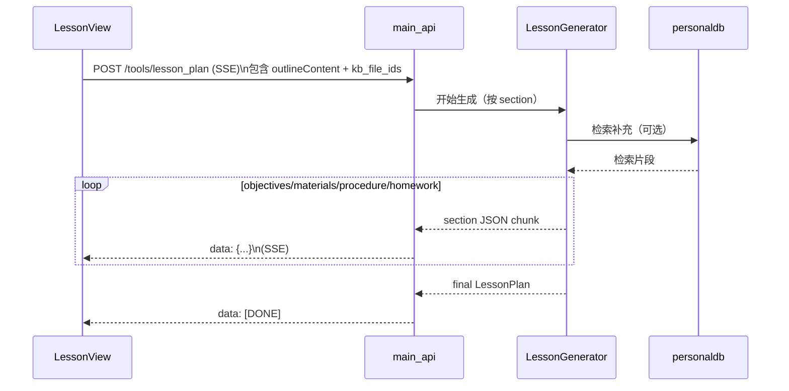

# TeachDo 教案（Word）功能开发计划（冻结版）

更新时间：2026-03-20  
状态：已冻结（需求口径不再变更）  
实现状态：主链路已落地（SSE 生成 + 预览 + 标准 `.docx` 导出）

---

## 1. 决策冻结（已确认）

1. 方案选择：`docxtpl + python-docx`（不从零实现 Word 引擎）
2. License 口径：本科毕设场景接受 `docxtpl` 的 LGPL-2.1-only（以依赖方式引入，不做 vendoring）；若未来商业化/对外交付需重新评估合规策略
3. 生成架构：与 PPT 主链路对齐（SSE 流式、参考大纲、可中断/可取消）
4. 样式/模板：在生成前选择（相当于 PPT 的模板选择步骤）；预览与导出使用同一套样式参数；允许在预览阶段调整样式并即时生效（不要求重新生成内容）
5. 预览形态：非编辑式“Word 纸张预览”（按样式渲染的结构化预览），不做富文本编辑器/拖拽排版
6. 文档落地：直接维护本文件为最终开发计划

---

## 2. 范围冻结（本期）

## 2.1 In Scope（本期必须完成）

1. 教案生成主链路：`Outline -> Lesson(SSE) -> 预览 -> 导出 .docx`
2. 生成必须参考大纲（无大纲时禁止生成并引导去 Outline）
3. Lesson 流式预览（分 section 更新，按“Word 纸张预览”渲染）
4. Word 标准导出（`.docx`），替换当前前端 `.doc` 兼容导出
5. 生成前样式/模板选择（字体/字号/行距/段距/页边距等），并在预览中可视化验证；导出使用同一套样式参数

## 2.2 Out of Scope（本期不做）

1. Word 编辑器（画布、富编辑、拖拽排版）
2. 多套学校模板市场/模板管理后台
3. 自动评测（LLM-as-judge）与复杂质量看板

---

## 3. 现状与改造目标

## 3.1 当前现状

1. Lesson 已上线：工作台可生成/预览/导出（前端：`frontend/src/components/workspace/LessonPlanView.vue`）
2. “下载 Word”已为后端标准 `.docx`（前端：`frontend/src/services/ai/lessonService.ts`；后端：`backend/main_api/main.py` 的 `/lesson/export/docx`）
3. 前端 `aiService` 已具备教案生成/导出/模板列表 API（`streamLessonPlan` / `exportLessonDocx` / `getLessonTemplates`）
4. 后端 `main_api` 已提供教案端点（`POST /tools/lesson_plan`、`GET /lesson/templates`、`POST /lesson/export/docx`），并包含无模型配置时的 fallback 生成逻辑

## 3.2 目标态

1. Lesson 像 PPT 一样走流式生成链路
2. Lesson 生成输出结构化 `LessonPlan`
3. 导出统一走后端 `.docx` 渲染
4. 前端做“样式/模板选择 + 结构化纸张预览 + 下载触发”（不做编辑器）

---

## 4. 架构设计（与 PPT 对齐）

### 4.1 总体架构图（PPT vs Lesson）



### 4.2 Lesson 生成时序（流式）



---

## 5. 复用策略（明确边界）

## 5.1 可直接复用

1. 前端：`apiClient`、`SseParser`、Abort 中断机制
2. BFF：`main_api` 编排模式与统一出口
3. KB：`kb_file_ids` 透传与检索调用链路
4. 状态：`material.lessonPlan` 持久化模型

## 5.2 新增但按 PPT 模式实现

1. Lesson 生成 API（SSE）
2. Lesson 分段生成控制器（按 section loop）
3. Lesson 预览渲染器（结构化分区）

## 5.3 明确不复用（避免过度工程）

1. editor-runtime（PPT 专属编辑器）
2. 图表/图片拆页逻辑（PPT 专属）
3. PPT 模板编辑能力

---

## 6. 需求与交互冻结

## 6.0 样式/模板（Lesson Style）原则

1. 样式是“展示/导出层”的参数，不参与 `LessonPlan` 内容生成本身（避免内容与样式强耦合）
2. 样式默认有一个预设（无需用户必选才能生成），但必须在预览中可见并可调整
3. 允许在预览阶段调整样式并即时生效（只影响预览与导出，不要求重新生成内容）

## 6.1 生成前置条件

1. 必须存在 `outlineContent`
2. 无大纲时显示 CTA：跳转 Outline
3. Lesson 样式未设置时使用默认预设（与 PPT 模板选择体验一致：可选但不强制）

## 6.2 预览要求

1. 实时展示生成中的教案内容（分 section 更新）
2. 预览使用“Word 纸张预览”（HTML/CSS 渲染）：展示字体/字号/行距/段距/页边距等效果，作为导出前校验
3. 仅显示预览，不提供编辑器能力（不可在预览里直接改内容/排版）
4. 预览属于“效果预览”，不强求与 Word 客户端的分页/换行 100% 一致；导出以 `.docx` 为准
5. 支持“取消生成/重新生成”

## 6.3 导出要求

1. 导出格式固定 `.docx`
2. 导出使用当前样式参数（与预览一致），样式参数包括但不限于：
   - 中文字体
   - 标题级别字号（Title/H1/H2/Body）
   - 行距、段前段后
   - 页边距（可选）

---

## 7. 接口契约冻结（V1）

## 7.1 `POST /tools/lesson_plan`（SSE）

请求体（JSON）：

```json
{
  "title": "单元标题",
  "subject": "学科",
  "description": "背景",
  "objectives": "教学目标文本",
  "outlineContent": "markdown 大纲",
  "language": "zh",
  "sessionId": "course_or_material_id",
  "kb_file_ids": ["fid1", "fid2"]
}
```

SSE 事件（`data:`）：

```json
{"type":"section","section":"objectives","data":["...","..."]}
{"type":"section","section":"materials","data":["..."]}
{"type":"section","section":"procedure","data":[{"step":"...","duration":"...","activity":"..."}]}
{"type":"section","section":"homework","data":"..."}
{"type":"final","data":{"title":"...","targetAudience":"...","duration":"...","objectives":[],"materials":[],"procedure":[],"homework":"..."}}
```

结束：

```text
data: [DONE]
```

## 7.2 `POST /lesson/export/docx`

请求体（JSON）：

```json
{
  "lessonPlan": {
    "title": "...",
    "targetAudience": "...",
    "duration": "...",
    "objectives": ["..."],
    "materials": ["..."],
    "procedure": [{"step":"...","duration":"...","activity":"..."}],
    "homework": "..."
  },
  "style": {
    "fontZh": "微软雅黑",
    "titleSizePt": 20,
    "h1SizePt": 16,
    "h2SizePt": 14,
    "bodySizePt": 12,
    "lineSpacing": 1.5
  }
}
```

响应：

1. `Content-Type: application/vnd.openxmlformats-officedocument.wordprocessingml.document`
2. `Content-Disposition: attachment; filename*=UTF-8''xxx.docx`

---

## 8. 实施计划（可执行）

## Phase 0：前端样式/模板选择（对齐 PPT 模板选择）

1. 定义 `LessonStyle`（默认预设 + 可配置参数），并持久化到 `material`（与 `material.lessonPlan` 同级）
2. Lesson 页增加“样式/模板选择”入口（位置对齐 PPT：Workspace header actions；参考 `frontend/src/components/workspace/ppt/PptTemplateSelector.vue` 的交互）
3. Lesson 纸张预览使用样式渲染（字体/字号/行距/段距/页边距），并支持实时切换样式验证

DoD：

1. 不生成教案也可先选择样式（默认预设可回退）
2. 样式选择可持久化（刷新后仍保留）
3. 预览的视觉效果与导出参数一致（同一套 style 数据源）

## Phase 1：后端接口骨架与契约测试（先跑通链路）

1. 新增 `POST /tools/lesson_plan`（先返回 mock SSE；SSE 头与 `[DONE]` 结束标记参考 `backend/main_api/main.py` 的 `/tools/ppt`（兼容别名：`/tools/aippt`））
2. 新增 `POST /lesson/export/docx`（先最小模板导出；下载返回范式参考 `backend/main_api/main.py` 的 `/kb/files/{user_id}/{file_id}/export`）
3. 补充单元测试（契约、错误码、流式结束标记）

DoD：

1. 前端可消费 lesson SSE 并结束于 `[DONE]`
2. 能下载可打开的 `.docx`

## Phase 2：前端接入 SSE（参考 PPT 生成实现）

1. 新增 `lessonService`：SSE 解析（复用 `SseParser`）、AbortController 取消、错误/完成态收敛（参考 `frontend/src/services/ai/pptService.ts` 的 `streamAipptSlides`）
2. Lesson 页实现状态机：`idle/generating/cancelled/done/error`
3. 流式预览：按 section 增量更新并落库到 `material.lessonPlan`（生成中也可保存部分结果用于回显；取消/重试交互参考 `frontend/src/components/workspace/ppt/usePptGeneration.ts`）

DoD：

1. 支持“生成 / 取消 / 重新生成”，取消不弹 error toast（与 PPT 一致）
2. 预览逐段更新，刷新后仍可回显已生成内容
3. 预览使用 Phase 0 的样式渲染（取消/重试不破坏样式选择）

## Phase 3：真实生成链路（参考大纲，先稳再强）

1. 接入真实 LLM 生成（按 section）
2. 强制参考 `outlineContent` 生成
3. 可选接入 KB 检索片段增强

DoD：

1. 无大纲时生成不可用
2. 有大纲时可稳定输出完整 `LessonPlan`

## Phase 4：Docx 导出（样式应用与兼容性）

1. 后端使用 `docxtpl + python-docx` 渲染 `.docx`（模板 + style 参数）
2. 前端“下载 Word”改为调用后端导出接口，文件名与 `Content-Disposition` 对齐
3. 建立最小回归样例（3 份 docx，覆盖：标题/列表/表格或流程段落），用于 Office/WPS/LibreOffice 手工验证

DoD：

1. 字体与字号配置对导出结果生效
2. 无配置时使用系统默认样式

---

## 9. 风险与控制

1. 许可证风险（`docxtpl` LGPL-2.1）
   - 动作：本项目按“本科毕设可接受”口径执行，但仍补齐第三方依赖 License Notice；若未来商业化/对外交付需重新评估

2. 兼容性风险（不同 Office 客户端）
   - 动作：建立最小回归样例（Windows Office / WPS / LibreOffice）

3. 生成质量风险
   - 动作：增加结构校验与字段完整性校验，禁止不完整结果落库

---

## 10. 最终执行口径

1. 本期按“与 PPT 同链路”执行 Lesson 生成功能（SSE + 参考大纲）。
2. 样式/模板在生成前选择；预览使用“Word 纸张预览”按样式渲染（不做编辑器能力）。
3. 导出统一后端 `.docx`，并与预览共用同一套样式参数。
4. 多模板与自动评测不进入本期范围。
