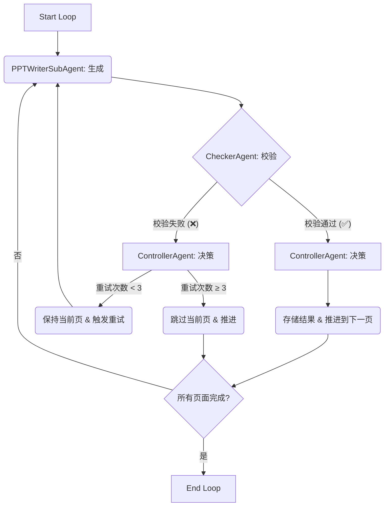

# 技术揭秘：AI-PPT 中的“强化学习驱动”机制 (GRPO)

## 1. 概述

在 AI-PPT 项目中，“强化学习驱动”并非指传统的深度强化学习算法（如 PPO），而是一种巧妙的**工程实践**，旨在确保 AI Agent 生成的 PPT 内容始终符合预定义的、严格的 JSON 结构规范。

该机制的核心是一种名为 **“生成-校验-控制” (Generate-Check-Control)** 的三步循环工作流。它通过模拟强化学习中的“试错-反馈-优化”循环，将一个不稳定的、可能产生格式错误的自由文本生成过程，转化为一个高可靠、始终输出结构化数据的健壮系统。

这种方法在思想上与 **GRPO (Generative Reinforcement Policy Optimization)** 吻合，即通过策略优化来约束生成模型，确保输出的质量和可用性。

## 2. 核心架构：三位一体的 Agent 协作

该机制由一个 `LoopAgent` 驱动，它内部包含三个按顺序执行的子 Agent，共同完成每一页 PPT 内容的生成与校验。

### 2.1. `PPTWriterSubAgent` (生成器)

- **角色**: 调用大语言模型 (LLM) 来丰富和填充单页 PPT 的 JSON 内容。
- **工作方式**:
    1.  **动态指令**: 根据当前页面类型（如封面、内容页），从 `prompt.py` 中加载对应的指令模板。
    2.  **严格约束**: Prompt 中包含了非常严格的“硬约束”，例如：
        - `严禁输出除 JSON 外的任何内容`
        - `不得修改已有字段的名称；不得删除既有字段`
        这些约束是引导 LLM 正确行为的第一道防线。
    3.  **接收反馈**: 如果上一轮生成失败，它会在新的上下文中感知到失败状态（通过重试机制），从而引导 LLM 修正其输出。

### 2.2. `CheckerAgent` (校验器)

- **角色**: 充当“环境”中的裁判，对生成器的输出进行确定性、基于规则的验证。**此过程不涉及 LLM**。
- **工作方式**:
    1.  **JSON 合法性校验**: 尝试从 LLM 返回的原始文本中提取并解析 JSON 数据。如果无法解析，则判定失败。
    2.  **业务规则校验**: 调用 `validate_slide` 函数，检查解析后的 JSON 是否符合预定义的 Schema，例如，是否包含所有必填字段。
    3.  **设置状态**: 将校验结果（`is_valid_json`, `last_validation_passed`）写入共享的 `state` 中，供下一步的控制器使用。

### 2.3. `ControllerAgent` (控制器)

- **角色**: 决策者，根据校验器的结果来控制整个循环的流程。
- **工作方式**:
    1.  **校验通过**:
        - 将有效的 JSON 结果存入最终的列表中。
        - 将页码 `current_slide_index` 加一，准备生成下一页。
        - 重置当前页的重试计数。
    2.  **校验失败**:
        - 将当前页的重试次数加一。
        - **重试**: 如果重试次数未超过阈值（默认为 3 次），则不推进页码，让 `LoopAgent` 重新触发 `PPTWriterSubAgent` 进行新一轮的生成。
        - **跳过**: 如果重试次数达到阈值，则判定此页无法可靠生成，将其跳过并推进到下一页，以避免无限循环。

## 3. 与强化学习的类比

这个机制可以看作是强化学习思想的一个简化版工程实现：

-   **Agent (智能体)**: `PPTWriterSubAgent` 及其背后的 LLM。
-   **Action (动作)**: 生成一段描述 PPT 页面的 JSON 文本。
-   **Environment (环境)**: 由 `CheckerAgent` 和 `ControllerAgent` 组成的校验与控制系统。
-   **Reward (奖励/惩罚)**:
    -   **正奖励**: `CheckerAgent` 校验通过，`ControllerAgent` 推进到下一页。
    -   **负奖励 (惩罚)**: `CheckerAgent` 校验失败，`ControllerAgent` 强制 Agent 重试。
-   **Policy Optimization (策略优化)**: 通过在 Prompt 中植入严格的格式约束，并在重试循环中让 LLM “反思”其错误输出，从而逐步优化其生成符合规范内容的“策略”。

## 4. 结论

AI-PPT 项目中的“强化学习驱动”是一个非常务实且高效的工程解决方案。它没有引入复杂算法的开销，而是通过巧妙的 Agent 协作和状态控制，构建了一个具备自我修正能力的闭环系统，极大地提升了 AI 生成结构化数据的可靠性和稳定性。